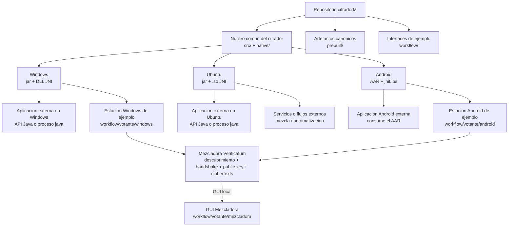
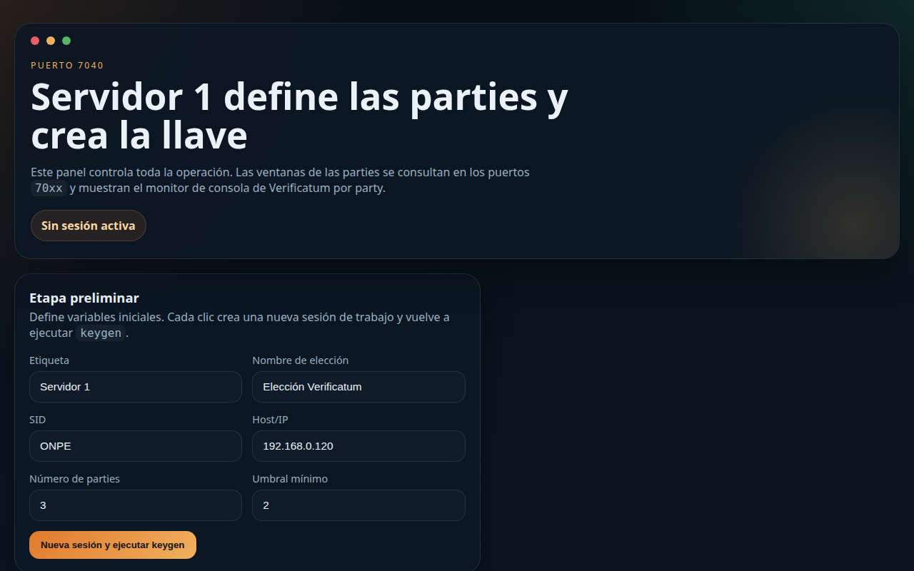
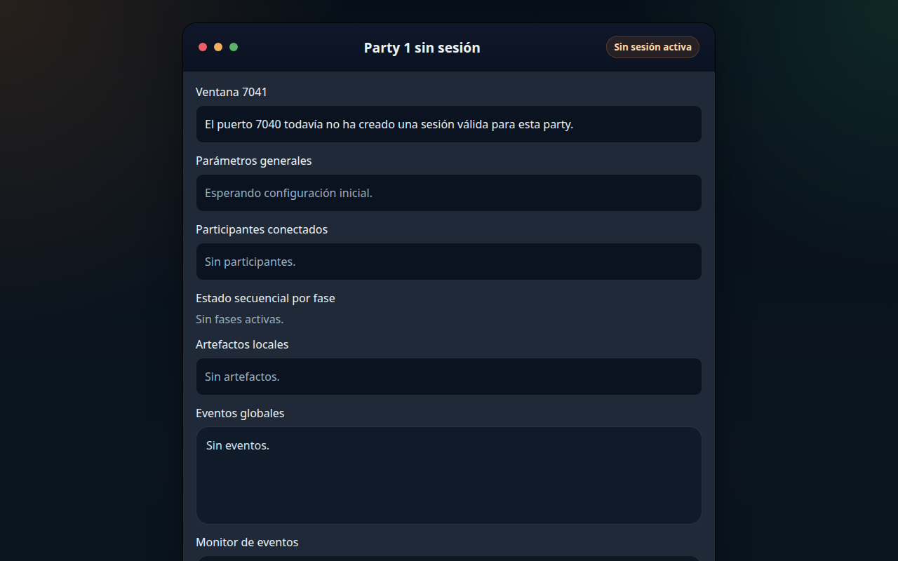
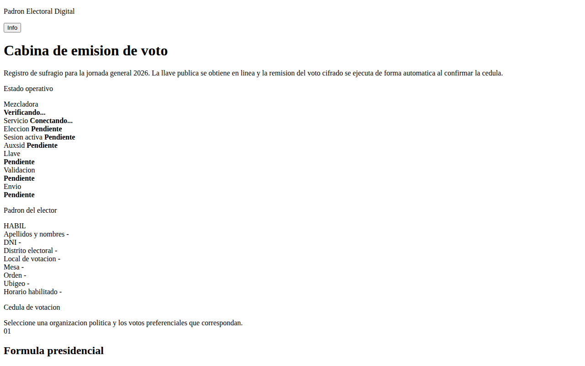
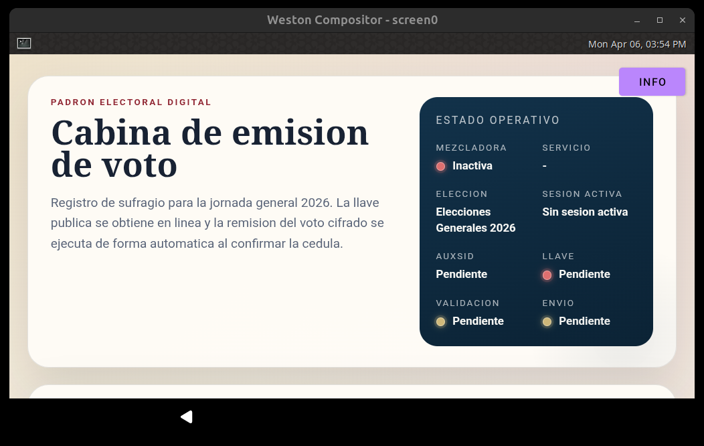

# ElGamalClient - Cifrado de Votos Electronicos

Implementacion del cifrado de votos electronicos usando ElGamal sobre curvas elipticas, con soporte multiplataforma para:

- `Windows x64`
- `Ubuntu/Linux`
- `Android`

El repositorio contiene tanto el cifrador como libreria reusable como estaciones de votacion de ejemplo que lo consumen.

## Indice

1. [Resumen](#resumen)
2. [Arquitectura](#arquitectura)
3. [Estado Actual](#estado-actual)
4. [Estructura Del Repositorio](#estructura-del-repositorio)
5. [Requisitos](#requisitos)
6. [Ruta Minima En Windows 10 Y 11](#ruta-minima-en-windows-10-y-11)
7. [Ruta Minima En Ubuntu](#ruta-minima-en-ubuntu)
8. [Ruta Minima En Android](#ruta-minima-en-android)
9. [Integracion Externa Como Libreria](#integracion-externa-como-libreria)
10. [RNG Y Soporte De Hardware](#rng-y-soporte-de-hardware)
11. [Layout Nativo Y Carga De JNI](#layout-nativo-y-carga-de-jni)
12. [Empaquetado Y Distribucion](#empaquetado-y-distribucion)
13. [Guia Rapida: Levantar Estaciones Y Mezcladora](#guia-rapida-levantar-estaciones-y-mezcladora)
14. [Instalacion De La Mezcladora En Windows Con WSL](#instalacion-de-la-mezcladora-en-windows-con-wsl)
15. [Resumen De Rendimiento](#resumen-de-rendimiento)
16. [Historial Breve](#historial-breve)
17. [Anexo: Bootstrap (solo si se necesita recompilar desde fuentes)](#anexo-bootstrap-solo-si-se-necesita-recompilar-desde-fuentes)

## Resumen

El cifrador se distribuye con filosofias distintas segun plataforma:

- `Windows` y `Ubuntu`:
  - artefacto canonico = `jar + librerias nativas JNI`
- `Android`:
  - artefacto canonico = `AAR`

La regla general del proyecto es:

- el cifrador debe poder ser consumido por cualquier interfaz externa
- las interfaces ubicadas en `workflow/` son solo consumidores de ejemplo
- ninguna aplicacion externa debe depender del codigo fuente interno del cifrador

## Arquitectura



Lectura rapida del diagrama:

- `Windows`: una app externa o la estacion de ejemplo consumen el mismo cifrador como `jar + DLL`
- `Ubuntu`: una app o servicio externo consume el mismo cifrador como `jar + .so`
- `Android`: una app externa o la estacion de ejemplo consumen el mismo cifrador como `AAR`
- la mezcladora no forma parte del cifrador; es un servicio aparte al que las estaciones de voto se conectan

## Estado Actual

Puntos principales del estado actual:

- el cifrador Java se compila con `Java 21`
- `Windows` usa `ElGamalCipher-1.1.0.jar` mas `vecj-2.2.0.dll` y `vmgj-1.3.0.dll`
- `Ubuntu` usa el mismo `jar` mas `libvecj` y `libvmgj`
- `Android` expone el cifrador como libreria reusable
- la estacion de votacion Windows consume el cifrador Windows como libreria
- la estacion de votacion Android consume el cifrador Android como libreria

## Estructura Del Repositorio

- `android/`
  - modulo Android del cifrador reusable
- `dist/`
  - artefactos finales listos para distribucion
- `docs/`
  - documentacion tecnica adicional
- `native/`
  - `verificatum-jars/` repositorio Maven file-based con JARs precompilados de Verificatum (resuelto automaticamente por Maven y Gradle)
  - `verificatum-src/` fuentes de `vcr`, `vec`, `gmpmee`, `vecj` y `vmgj` (solo necesarios si se quiere recompilar desde cero)
- `prebuilt/`
  - artefactos canonicos compilados para consumo posterior
- `recursos/`
  - llaves, votos y recursos de prueba
- `scripts/`
  - scripts de compilacion, empaquetado, entorno y pruebas por plataforma
- `src/`
  - codigo Java principal del cifrador
- `tools/`
  - herramientas auxiliares separadas del flujo principal
- `workflow/`
  - estaciones de votacion y consumidores de ejemplo del cifrador
  - incluye la GUI de la mezcladora Verificatum en `workflow/votante/mezcladora`

## Requisitos

- `Java 21` o superior
- `Maven 3.x` (opcional: el proyecto incluye Maven Wrapper `mvnw` / `mvnw.cmd`)

Requisitos adicionales por plataforma:

- `Windows`
  - PowerShell
  - `MSYS2 UCRT64` si se van a recompilar DLL JNI
- `Ubuntu`
  - toolchain nativo para JNI Linux
- `Android`
  - Android SDK / Gradle para compilar el `AAR` o el consumidor Android

## Ruta Minima En Windows 10 Y 11

Ruta unica recomendada para instalar, probar y desplegar en `Windows 10 y 11`:

- use `PowerShell`
- en la primera ejecucion, abra PowerShell como administrador
- mantenga acceso a Internet para instalar `Git`, `Java 21`, `Maven Wrapper` y `MSYS2 UCRT64`

Instalacion minima de dependencias y descarga del repo:

Comprobacion minima de `winget`:

```powershell
Get-Command winget -All
where.exe winget
Test-Path "$env:LOCALAPPDATA\Microsoft\WindowsApps\winget.exe"
```

Resultado esperado:

- `Get-Command winget -All` encuentra el comando
- `where.exe winget` devuelve una ruta valida

Si `Get-Command winget -All` falla, pero `Test-Path "$env:LOCALAPPDATA\Microsoft\WindowsApps\winget.exe"` devuelve `True`, configure `PATH` asi:

```powershell
$env:Path += ";$env:LOCALAPPDATA\Microsoft\WindowsApps"
winget --version
```

Si `winget --version` ya responde, deje el cambio permanente:

```powershell
[Environment]::SetEnvironmentVariable(
  "Path",
  [Environment]::GetEnvironmentVariable("Path","User") + ";$env:LOCALAPPDATA\Microsoft\WindowsApps",
  "User"
)
```

Luego cierre PowerShell y abra una nueva consola antes de continuar.

Verificacion directa opcional:

```powershell
& "$env:LOCALAPPDATA\Microsoft\WindowsApps\winget.exe" --version
```

Si ese comando directo funciona, el problema era solo el `PATH`.

Una vez que `winget` responda correctamente, instale dependencias base y descargue la rama `cifradorM` asi:

```powershell
winget install --id Git.Git -e --accept-package-agreements --accept-source-agreements
winget install --id Microsoft.OpenJDK.21 -e --accept-package-agreements --accept-source-agreements

# Cierre esta consola y abra otra ventana de PowerShell antes de continuar.

git clone -b cifradorM https://github.com/rmartinezch/ElGamalClient.git C:\cifradorM
cd C:\cifradorM
```

Si ya tenia una version anterior de Java (por ejemplo Java 11), el `PATH` del sistema puede seguir apuntando a ella. Para forzar que la sesion actual use Java 21, ejecute:

```powershell
$jdk21 = Get-ChildItem "C:\Program Files\Microsoft\jdk-21*" -Directory | Select-Object -First 1
$env:JAVA_HOME = $jdk21.FullName
$env:PATH = "$env:JAVA_HOME\bin;$env:PATH"
```

Para que el cambio sea permanente (sobreviva al cerrar la terminal):

```powershell
[System.Environment]::SetEnvironmentVariable("JAVA_HOME", $jdk21.FullName, "User")
```

Comprobaciones minimas del entorno instalado:

```powershell
git --version
javac -version
java -version
Test-Path C:\cifradorM
```

Resultado esperado:

- `git --version` responde sin error
- `javac -version` y `java -version` muestran `21`
- `Test-Path C:\cifradorM` devuelve `True`

Si `javac -version` o `git --version` no responden despues de instalar con `winget`, cierre y abra una nueva consola PowerShell antes de continuar.

Si ya tiene el repo descargado en otra ruta, muevalo o vuelva a clonarlo en `C:\cifradorM`.

Comprobaciones minimas del repo clonado:

```powershell
cd C:\cifradorM
git branch --show-current
git remote get-url origin
Test-Path .\native\verificatum-src\verificatum-vcr-3.1.0
Test-Path .\native\verificatum-src\verificatum-vecj-2.2.0
Test-Path .\native\verificatum-jars\com\verificatum\verificatum-vmgj\1.3.0\verificatum-vmgj-1.3.0.jar
```

Resultado esperado:

- `git branch --show-current` devuelve `cifradorM`
- `git remote get-url origin` devuelve `https://github.com/rmartinezch/ElGamalClient.git`
- los tres `Test-Path` devuelven `True`

Recompilacion minima de todos los artefactos Windows (`jar + DLL JNI`):

```powershell
cd C:\cifradorM
powershell -ExecutionPolicy Bypass -File .\scripts\windows\compilacion\build-cifrador.ps1 `
  -MavenCmd C:\cifradorM\mvnw.cmd `
  -ForceNativeBuild
```

Comprobaciones minimas del build:

```powershell
Test-Path .\prebuilt\java\ElGamalCipher-1.1.0.jar
Test-Path .\prebuilt\windows-x64\vecj-2.2.0.dll
Test-Path .\prebuilt\windows-x64\vmgj-1.3.0.dll
Get-Item .\prebuilt\java\ElGamalCipher-1.1.0.jar
Get-Item .\prebuilt\windows-x64\vecj-2.2.0.dll
Get-Item .\prebuilt\windows-x64\vmgj-1.3.0.dll
```

Resultado esperado:

- los tres `Test-Path` devuelven `True`
- `Get-Item` muestra fecha y tamaño de archivos recientes en `prebuilt\java` y `prebuilt\windows-x64`

Este flujo:

- recompila el JAR principal del cifrador
- fuerza la regeneracion de `vecj-2.2.0.dll` y `vmgj-1.3.0.dll`
- ejecuta `bootstrap-verificatum.ps1` automaticamente si faltan artefactos de Verificatum en el repo local
- instala y actualiza `MSYS2 UCRT64` automaticamente si hace falta para la compilacion nativa

Artefactos recompilados para despliegue:

- `C:\cifradorM\prebuilt\java\ElGamalCipher-1.1.0.jar`
- `C:\cifradorM\prebuilt\windows-x64\vecj-2.2.0.dll`
- `C:\cifradorM\prebuilt\windows-x64\vmgj-1.3.0.dll`

Prueba minima por CLI:

```powershell
java -jar "C:\cifradorM\prebuilt\java\ElGamalCipher-1.1.0.jar" `
  'C:\cifradorM\recursos\publicKey' `
  'C:\cifradorM\recursos\shuffled_votes.txt' `
  'C:\cifradorM\recursos\ciphertexts_ext' `
  -sw `
  -p
```

Si el uso final es desde otra aplicacion Java en Windows, despliegue siempre el `jar`
junto con ambas DLL del directorio `prebuilt\windows-x64`.

JARs incluidos en `native/verificatum-jars/`:

| Artefacto | Version | Tamaño |
|-----------|---------|--------|
| `verificatum-vcr-vmgj-vecj` | 3.1.0 | 1.7 MB |
| `verificatum-vecj` | 2.2.0 | 6.8 KB |
| `verificatum-vmgj` | 1.3.0 | 9.8 KB |

Fuentes incluidos en `native/verificatum-src/`:

| Paquete | Version | Uso |
|---------|---------|-----|
| `verificatum-vcr` | 3.1.0 | Solo si se necesita recompilar VCR desde fuentes |
| `verificatum-vecj` | 2.2.0 | Solo si se necesita recompilar VECJ desde fuentes |
| `verificatum-vmgj` | 1.3.0 | Solo si se necesita recompilar VMGJ desde fuentes |
| `verificatum-gmpmee` | 2.1.0 | Dependencia nativa de VCR |
| `verificatum-vec` | 2.5.0 | Dependencia nativa de VECJ |

## Ruta Minima En Ubuntu

Ruta unica recomendada para instalar, probar y desplegar en `Ubuntu 22.04+`:

- use `Bash`
- mantenga acceso a Internet para instalar dependencias

Instalacion minima de dependencias y descarga del repo:

```bash
sudo apt update
sudo apt install -y git openjdk-21-jdk build-essential autoconf automake libtool libgmp-dev
```

Descarga del repositorio:

```bash
git clone -b cifradorM https://github.com/rmartinezch/ElGamalClient.git ~/cifradorM
cd ~/cifradorM
```

Comprobaciones minimas del entorno instalado:

```bash
git --version
javac -version
java -version
test -d ~/cifradorM && echo "OK"
```

Resultado esperado:

- `git --version` responde sin error
- `javac -version` y `java -version` muestran `21`
- el directorio `~/cifradorM` existe

Comprobaciones minimas del repo clonado:

```bash
cd ~/cifradorM
git branch --show-current
git remote get-url origin
test -d native/verificatum-src/verificatum-vcr-3.1.0 && echo "OK"
test -d native/verificatum-src/verificatum-vecj-2.2.0 && echo "OK"
test -f native/verificatum-jars/com/verificatum/verificatum-vmgj/1.3.0/verificatum-vmgj-1.3.0.jar && echo "OK"
```

Resultado esperado:

- `git branch --show-current` devuelve `cifradorM`
- `git remote get-url origin` devuelve `https://github.com/rmartinezch/ElGamalClient.git`
- los tres `test` devuelven `OK`

Recompilacion minima de todos los artefactos Ubuntu (`jar + .so JNI`):

```bash
cd ~/cifradorM
./scripts/ubuntu/compilacion/build-cifrador.sh
```

Comprobaciones minimas del build:

```bash
test -f prebuilt/java/ElGamalCipher-1.1.0.jar && echo "OK"
ls -la prebuilt/java/ElGamalCipher-1.1.0.jar
ls -la prebuilt/linux-x64/
```

Resultado esperado:

- el JAR existe en `prebuilt/java/`
- las librerias nativas `.so` existen en `prebuilt/linux-x64/`

Este flujo:

- recompila el JAR principal del cifrador
- compila `libvecj.so` y `libvmgj.so`
- ejecuta `bootstrap-verificatum.sh` automaticamente si faltan artefactos de Verificatum

Artefactos recompilados para despliegue:

- `~/cifradorM/prebuilt/java/ElGamalCipher-1.1.0.jar`
- `~/cifradorM/prebuilt/linux-x64/libvecj.so`
- `~/cifradorM/prebuilt/linux-x64/libvmgj.so`

Prueba minima por CLI:

```bash
java -jar ~/cifradorM/prebuilt/java/ElGamalCipher-1.1.0.jar \
  ~/cifradorM/recursos/publicKey \
  ~/cifradorM/recursos/shuffled_votes.txt \
  ~/cifradorM/recursos/ciphertexts_ext \
  -sw \
  -p
```

Si el uso final es desde otra aplicacion Java en Ubuntu, despliegue siempre el `jar`
junto con ambas `.so` del directorio `prebuilt/linux-x64`.

## Ruta Minima En Android

Ruta unica recomendada para compilar y probar en `Android`:

- se ejecuta desde una maquina host `Ubuntu` o `Windows con WSL`
- requiere Android SDK y NDK instalados

Instalacion minima de dependencias en el host:

```bash
sudo apt update
sudo apt install -y git openjdk-21-jdk build-essential autoconf automake libtool libgmp-dev
```

Si aun no tiene Android SDK, instale Android Studio o el SDK command-line tools
y configure las variables de entorno:

```bash
export ANDROID_SDK_ROOT="$HOME/Android/Sdk"
export PATH="$ANDROID_SDK_ROOT/platform-tools:$ANDROID_SDK_ROOT/cmdline-tools/latest/bin:$PATH"
```

Descarga del repositorio (si aun no lo tiene):

```bash
git clone -b cifradorM https://github.com/rmartinezch/ElGamalClient.git ~/cifradorM
cd ~/cifradorM
```

Comprobaciones minimas del entorno instalado:

```bash
git --version
javac -version
java -version
test -d "$ANDROID_SDK_ROOT" && echo "SDK OK"
test -d ~/cifradorM && echo "Repo OK"
```

Resultado esperado:

- `git --version` responde sin error
- `javac -version` y `java -version` muestran `21`
- el SDK de Android existe
- el directorio `~/cifradorM` existe

Compilacion minima de todos los artefactos Android (`AAR + JNI`):

```bash
cd ~/cifradorM
./scripts/android/compilacion/build-cifrador.sh
```

Comprobaciones minimas del build:

```bash
test -f prebuilt/android/aar/ElGamalCipher-android-debug.aar && echo "OK"
ls -la prebuilt/android/jniLibs/arm64-v8a/
ls -la prebuilt/android/jniLibs/x86_64/
```

Resultado esperado:

- el AAR existe en `prebuilt/android/aar/`
- las librerias JNI existen para `arm64-v8a` y `x86_64`

Este flujo:

- compila las librerias JNI nativas para Android (`arm64-v8a`, `x86_64`)
- genera el AAR del cifrador Android

Artefactos compilados para despliegue:

- `~/cifradorM/prebuilt/android/aar/ElGamalCipher-android-debug.aar`
- `~/cifradorM/prebuilt/android/jniLibs/arm64-v8a/`
- `~/cifradorM/prebuilt/android/jniLibs/x86_64/`

Para consumir el AAR desde una app Android externa, agregue el `.aar` como dependencia
en el `build.gradle` de su proyecto. No necesita las `.so` sueltas; ya estan dentro del AAR.

## Integracion Externa Como Libreria

### Filosofia General

- `Windows` y `Ubuntu` consumen `jar + JNI`
- `Android` consume `AAR`
- el cifrador es la libreria
- las interfaces de votacion son consumidores separados

### Modos De Integracion Segun Plataforma

En `Windows` y `Ubuntu` existen dos formas validas de integracion:

- como API Java embebida dentro de una aplicacion propia
- como proceso externo lanzando `java` contra el `jar`

Ambas opciones usan el mismo cifrador y ambas siguen requiriendo las bibliotecas JNI nativas de la plataforma.

En `Android` el modelo canonico es distinto:

- la integracion se hace consumiendo el `AAR` como libreria dentro de la app Android
- no se considera un uso externo por CLI ni lanzando un proceso `java` separado
- la API publica Android vive dentro del propio `AAR`

### API Java Comun Para Windows Y Ubuntu

Esta API aplica a consumidores Java externos en `Windows` y `Ubuntu`.

No aplica directamente a `Android`, porque en Android el punto de integracion canonico es el `AAR`.

Clases principales:

- `pe.gob.onpe.votodigital.elgamalcipher.ElGamalCipherService`
- `pe.gob.onpe.votodigital.elgamalcipher.CifradorRequest`
- `pe.gob.onpe.votodigital.elgamalcipher.CifradorRngMode`
- `pe.gob.onpe.votodigital.elgamalcipher.LogConfig`

Ejemplo minimo para una aplicacion Java que luego se ejecuta en `Windows` o `Ubuntu` con las librerias JNI correctas:

```java
import java.nio.file.Path;
import java.util.logging.Level;
import java.util.logging.Logger;
import pe.gob.onpe.votodigital.elgamalcipher.CifradorRequest;
import pe.gob.onpe.votodigital.elgamalcipher.CifradorRngMode;
import pe.gob.onpe.votodigital.elgamalcipher.ElGamalCipherService;
import pe.gob.onpe.votodigital.elgamalcipher.LogConfig;

public final class DemoCifrado {
    public static void main(String[] args) {
        Logger logger = LogConfig.getLogger(
            "./logs/demo-cifrador.log",
            Level.INFO,
            true,
            true,
            true,
            true,
            true
        );

        CifradorRequest request = new CifradorRequest(
            Path.of("recursos/publicKey"),
            Path.of("recursos/shuffled_votes.txt"),
            Path.of("salida/ciphertexts_ext"),
            CifradorRngMode.SOFTWARE,
            false
        );

        boolean ok = new ElGamalCipherService(logger).encrypt(request);
        if (!ok) {
            throw new IllegalStateException("El cifrado no produjo salida.");
        }
    }
}
```

### Integracion Externa En Windows

Una aplicacion externa en Windows debe consumir:

- `ElGamalCipher-1.1.0.jar`
- `vecj-2.2.0.dll`
- `vmgj-1.3.0.dll`

Ejemplo:

```powershell
$PROJECT_ROOT = 'C:\cifradorM'
$APP_JAR = 'C:\cifradorM\mi-app.jar'

java `
  "-Djava.library.path=$PROJECT_ROOT\prebuilt\windows-x64" `
  -cp "$PROJECT_ROOT\prebuilt\java\ElGamalCipher-1.1.0.jar;$APP_JAR" `
  com.ejemplo.Main
```

Importante:

- el artefacto canonico Windows es libreria, no `.exe`
- no copies solo el `jar`; copia tambien las DLL JNI

### Integracion Externa En Ubuntu

Una aplicacion externa en Ubuntu debe enlazar el `jar` y exponer `libvecj` y `libvmgj`.

Ejemplo:

```bash
java \
  -Djava.library.path=/ruta/al/proyecto/prebuilt/linux-x64 \
  -cp /ruta/al/proyecto/prebuilt/java/ElGamalCipher-1.1.0.jar:mi-app.jar \
  com.ejemplo.Main
```

### Integracion Externa En Android

En `Android` no se usa el cifrador como proceso externo ni como CLI independiente.

La forma correcta de integracion es consumir el `AAR` compilado dentro de la app Android, es decir, usar la API publica del cifrador como libreria embebida:

```kotlin
dependencies {
    implementation(files("/ruta/al/proyecto/prebuilt/android/aar/ElGamalCipher-android-debug.aar"))
}
```

API Android principal:

- `pe.gob.onpe.votodigital.cifrador.android.AndroidCipherRunner`
- `pe.gob.onpe.votodigital.cifrador.android.AndroidCipherLibraryInfo`
- `pe.gob.onpe.votodigital.cifrador.android.AndroidTrueRngSupport`

El `AAR` ya empaqueta:

- bridge Android
- `jniLibs` para `arm64-v8a`
- `jniLibs` para `x86_64`
- soporte TrueRNG USB para Android

Resumen por plataforma:

- `Windows`: usa la API Java comun mas `jar + DLL`
- `Ubuntu`: usa la API Java comun mas `jar + .so`
- `Android`: usa el `AAR` y su API Android publica

## RNG Y Soporte De Hardware

### Ubuntu

- `-sw` usa `RandomDevice()` con `/dev/urandom`
- `-hw` usa TrueRNG por:
  - propiedad JVM `-Delgamal.rng.device=<ruta>`
  - variable `ELGAMAL_RNG_DEVICE`
  - valor por defecto `/dev/TrueRNG0`

### Windows

- `-sw` usa `SecureRandom`
- `-hw` usa TrueRNG por:
  - autodeteccion `VID:PID 04D8:F5FE`
  - propiedad JVM `-Delgamal.rng.device=COMx`
  - variable `ELGAMAL_RNG_DEVICE=COMx`

### Android

- `-sw` usa `SecureRandom`
- `-hw` usa TrueRNG USB cuando el dispositivo esta conectado por OTG, Android detecta un driver serial compatible y la app ya tiene permiso USB
- el `AAR` ya incluye `AndroidTrueRngSupport` y `AndroidUsbTrueRngRandomSource`; no hace falta que la app consumidora implemente por su cuenta la lectura del TrueRNG
- si no hay dispositivo, driver o permiso USB, la ejecucion en modo hardware falla de forma explicita; no se degrada silenciosamente a `SecureRandom`
- la app consumidora si debe manejar permisos USB, diagnostico del dispositivo y ciclo de vida Android alrededor del uso del TrueRNG

### Otros Sistemas

- `-sw` y `-hw` usan `SecureRandom`

## Layout Nativo Y Carga De JNI

La aplicacion busca bibliotecas nativas en este orden:

1. `prebuilt/<os-arch>`
2. `prebuilt`
3. `libs/<os-arch>`
4. `libs`

Ejemplos:

- `prebuilt/linux-x64/libvecj-2.2.0.so`
- `prebuilt/windows-x64/vecj-2.2.0.dll`

Si el `jar` se ejecuta sin `java.library.path` y encuentra un layout local valido, puede relanzarse con la ruta correcta.

## Empaquetado Y Distribucion

### Windows

Build del bundle de libreria:

```powershell
cd C:\cifradorM
powershell -ExecutionPolicy Bypass -File .\scripts\windows\empaquetado\build-cifrador-portable.ps1
```

Salida:

- `dist/windows/library/Cifrador/app/ElGamalCipher-1.1.0.jar`
- `dist/windows/library/Cifrador/libs/windows-x64/vecj-2.2.0.dll`
- `dist/windows/library/Cifrador/libs/windows-x64/vmgj-1.3.0.dll`

ZIP del bundle:

```powershell
cd C:\cifradorM
powershell -ExecutionPolicy Bypass -File .\scripts\windows\empaquetado\package-cifrador-portable.ps1
```

Salida:

- `dist/windows/Cifrador-1.1.0-windows-x64-library.zip`

### Ubuntu

Imagen portable:

```bash
./scripts/ubuntu/empaquetado/build-cifrador-portable.sh
```

Salida:

- `dist/linux/image/Cifrador/Cifrador`
- `dist/linux/image/Cifrador/runtime`
- `dist/linux/image/Cifrador/app`
- `dist/linux/image/Cifrador/libs/linux-x64`

Paquete comprimido:

```bash
./scripts/ubuntu/empaquetado/package-cifrador-portable.sh
```

Salida:

- `dist/linux/Cifrador-1.1.0-linux-x64-portable.tar.gz`

### Android

Imagen portable:

```bash
./scripts/android/empaquetado/build-cifrador-portable.sh
```

Salida:

- `dist/android/image/Cifrador/aar/Cifrador-android-debug.aar`
- `dist/android/image/Cifrador/jniLibs/arm64-v8a/`
- `dist/android/image/Cifrador/jniLibs/x86_64/`
- `dist/android/image/Cifrador/metadata/checksums.sha256`

Paquete comprimido:

```bash
./scripts/android/empaquetado/package-cifrador-portable.sh
```

Salida:

- `dist/android/Cifrador-1.1.0-android-portable.zip`

## Guia Rapida: Levantar Estaciones Y Mezcladora

Esta seccion muestra como arrancar cada componente del flujo de votacion
electronica y verificar que funcionan en conjunto.

### 1. Mezcladora Verificatum (panel de control)

La mezcladora opera las `parties` de Verificatum desde una GUI web local.

```bash
cd workflow/votante/mezcladora
./start_gui.sh
```

Se abre el panel principal en `http://localhost:7040`:



Campos iniciales:

| Campo | Descripcion |
|-------|-------------|
| Etiqueta | nombre visible de la eleccion |
| Nombre de eleccion | identificador logico |
| SID | session ID de Verificatum |
| Host/IP | IP del servidor (por defecto `0.0.0.0`) |
| Numero de parties | cuantas parties participan |
| Umbral minimo | minimo de parties para descifrar |

Cada party se levanta en su propia ventana (`http://localhost:7041`, `7042`, ...):



Desde esta ventana se monitorean: parametros generales, participantes conectados,
estado secuencial por fase, artefactos locales y eventos globales.

### 2. Estacion votante — Windows

```powershell
cd workflow\votante\windows
.\start.bat
```

Se abre la cabina de voto en `http://localhost:8788`:



La interfaz muestra el estado operativo (conexion a mezcladora, sesion activa,
llave publica, validacion, envio), el padron del elector y la cedula de votacion.

### 3. Estacion votante — Android

En Ubuntu con Waydroid:

```bash
cd workflow/votante/android
SHOW_UI=1 CLEAN_START=0 bash run-votante-waydroid-weston.sh
```

El script instala el APK en Waydroid y lanza la app automaticamente:



La app Android muestra la misma cabina de voto con el panel de estado operativo,
padron del elector y cedula de votacion, adaptada al formato movil.

### Flujo basico de prueba

1. Levantar la mezcladora (`start_gui.sh`) y configurar la eleccion desde el panel
2. Arrancar al menos una estacion votante (Windows o Android)
3. Desde la estacion, verificar que el estado operativo muestra `Mezcladora: Activa`
4. Seleccionar candidatos en la cedula y confirmar el voto
5. En el panel de la mezcladora, ejecutar `shuffle` y `decrypt`
6. Comparar los votos descifrados con los originales

## Instalacion De La Mezcladora En Windows Con WSL

La GUI de la mezcladora vive en `workflow/votante/mezcladora`, pero su ejecucion real esta pensada para un entorno tipo Ubuntu. En Windows, la forma recomendada es correrla dentro de `WSL` y publicar los puertos hacia Windows.

### Requisitos

- `WSL 2` habilitado en Windows
- una distribucion Ubuntu instalada en WSL
- `python3` disponible dentro de WSL
- herramientas Verificatum instaladas dentro de WSL: `vmn`, `vmni`, `vmnc`, `vmnd`, `vog`

### 1. Instalar WSL y Ubuntu en Windows

En PowerShell como administrador:

```powershell
wsl --install -d Ubuntu
```

Despues reinicie Windows si el sistema lo solicita y complete la creacion del usuario Linux.

### 2. Entrar a Ubuntu y preparar paquetes base

```powershell
wsl -d Ubuntu
```

Ya dentro de Ubuntu:

```bash
sudo apt update
sudo apt install -y python3 python3-venv python3-pip
```

Si Verificatum ya esta instalado en su WSL, basta con validar que los binarios respondan:

```bash
which vmn vmni vmnc vmnd vog
python3 --version
```

#### Si Verificatum no existe en WSL

Para un entorno de pruebas, puede usar la instalacion `online` de Verificatum dentro de WSL. Esta variante descarga el paquete `verificatum-vmn-3.1.0-full.tar.gz` y deja disponibles los comandos requeridos por la mezcladora.

Instale primero las dependencias base:

```bash
sudo apt-get update
sudo apt-get install --yes m4 cpp gcc make libtool automake autoconf libgmp-dev openjdk-21-jdk wget
```

Luego descargue e instale Verificatum:

```bash
cd ~
wget https://github.com/rmartinezch/mixnet/raw/main/installer/verificatum-vmn-3.1.0-full.tar.gz
mkdir -p verificatum-vmn-3.1.0-full
tar xvfz verificatum-vmn-3.1.0-full.tar.gz -C verificatum-vmn-3.1.0-full
cd verificatum-vmn-3.1.0-full
sudo make install
```

Validacion recomendada:

```bash
vmn -version
which vmn vmni vmnc vmnd vog vmnv
vog -rndinit RandomDevice /dev/urandom
```

Notas:

- esta ruta `online` es adecuada para laboratorio o pruebas en WSL
- `openssh-server` no es necesario si la mezcladora se usara solo de forma local en la misma PC
- si desea un flujo mas controlado, puede compilar Verificatum desde `native/verificatum-src/`, pero no es obligatorio para levantar la GUI en WSL

### 3. Ir a la carpeta de la mezcladora desde WSL

Si el repo esta en `C:\cifradorM`, en WSL normalmente se vera asi:

```bash
cd /mnt/c/cifradorM/workflow/votante/mezcladora
```

### 4. Iniciar la GUI de la mezcladora

```bash
./start_gui.sh
```

El script arranca `server.py` con `python3`, escucha por defecto en `0.0.0.0` y publica:

- panel principal en `7040`
- ventanas de `party` en `7041` a `7049`

Si desea forzar host o puerto base:

```bash
HOST=0.0.0.0 PUBLIC_HOST=127.0.0.1 ./start_gui.sh
./start_gui.sh 7140
```

### 5. Publicar los puertos de WSL hacia Windows

Abra otra consola PowerShell como administrador y ejecute:

```powershell
cd C:\cifradorM
powershell -ExecutionPolicy Bypass -File .\workflow\votante\mezcladora\scripts\configure_windows_portproxy.ps1
```

Ese script crea reglas `portproxy` y firewall para reenviar `7040-7049` desde la IP principal de Windows hacia la IP actual de WSL.

### 6. Abrir la mezcladora desde Windows

Con la mezcladora ya levantada en WSL, abra en Windows:

```text
http://127.0.0.1:7040
```

Si va a usar otra maquina de la red local, puede abrirla con la IP principal de Windows que haya detectado el script de `portproxy`.

### Notas utiles

- si reinicia WSL, la IP interna puede cambiar; en ese caso vuelva a ejecutar `configure_windows_portproxy.ps1`
- para una ejecucion local simple en la misma PC, normalmente basta con WSL + `start_gui.sh` + `portproxy`
- las pruebas E2E de esta GUI usan `node` y `npm`, pero no son necesarias solo para operar la mezcladora
- para mas detalle operativo de la GUI y su API REST, revise `workflow/votante/mezcladora/README.md`

## Resumen De Rendimiento

Prueba de referencia con `10,000` votos:

| Metrica | Version Original | Version Optimizada | Mejora |
| :--- | :---: | :---: | :---: |
| Tiempo de ejecucion | ~1m 22s | ~10s | ~8x |
| Uso de CPU | un nucleo | multi-nucleo | mejora sustancial |

Mejoras clave:

- paralelismo con streams
- `ThreadLocal<RandomSource>`
- barra de progreso opcional
- control de modo hardware para TrueRNG

## Historial Breve

### Version 1.1.0

- refactor para calidad de codigo
- uso de capacidades modernas de Java 21
- mejoras de logs, estructura y portabilidad

### Version 1.0.0

- optimizacion de rendimiento
- paralelismo y mejora del acceso al RNG

### Rama `cifradorM`

- soporte multiplataforma
- empaquetado nativo por plataforma
- consolidacion del cifrador como libreria reusable
- proyecto autocontenido: JARs Verificatum en `native/verificatum-jars/` (ya no requiere bootstrap)
- Maven Wrapper incluido (`mvnw` / `mvnw.cmd`)
- fuentes VCR 3.1.0 incluidos en `native/verificatum-src/`
- verificado en Ubuntu, Windows 11 y Android (emulador API 34)

## Anexo: Bootstrap (solo si se necesita recompilar desde fuentes)

El bootstrap solo es necesario si se quiere recompilar los JARs de Verificatum desde codigo
fuente (por ejemplo, para aplicar parches o actualizar versiones). En uso normal,
los JARs de `native/verificatum-jars/` son suficientes.

### Ruta usada para bootstrap en Windows

Para la ruta minima documentada en este README, use una sola raiz:

- `C:\cifradorM`

Si alguna vez necesita recompilar Verificatum desde fuentes en Windows, el bootstrap debe
resolver los paquetes dentro del propio repo:

```
C:\cifradorM\native\verificatum-src\verificatum-vcr-3.1.0
C:\cifradorM\native\verificatum-src\verificatum-vecj-2.2.0
C:\cifradorM\native\verificatum-jars\com\verificatum\verificatum-vmgj\1.3.0\verificatum-vmgj-1.3.0.jar
```

Si el error dice `No se pudo ubicar verificatum-vcr-3.1.0. Rutas probadas: ...` significa
que los fuentes no estan en ninguna de esas ubicaciones. Con la version actual del proyecto,
los fuentes ya estan incluidos en `native\verificatum-src\` y los JARs precompilados en
`native\verificatum-jars\`, por lo que este error no deberia ocurrir despues de un `git pull`
si el repo esta en `C:\cifradorM`.

### Dependencias esperadas para Windows

Para que `scripts/windows/compilacion/bootstrap-verificatum.ps1` funcione dentro de la ruta
minima de Windows, basta con que existan estas rutas dentro del repo:

- `C:\cifradorM\native\verificatum-src\verificatum-vcr-3.1.0`
- `C:\cifradorM\native\verificatum-src\verificatum-vecj-2.2.0`
- `C:\cifradorM\native\verificatum-jars\com\verificatum\verificatum-vmgj\1.3.0\verificatum-vmgj-1.3.0.jar`

Importante:

- para la ruta minima de prueba en Windows, use una sola raiz: `C:\cifradorM`
- el bootstrap es opcional; no hace falta para compilar ni para probar el cifrador normal
- solo considere `MIXNET_ROOT` o rutas externas si esta saliendo del flujo minimo de este README

Windows:

```powershell
cd C:\cifradorM
powershell -ExecutionPolicy Bypass -File .\scripts\windows\compilacion\bootstrap-verificatum.ps1
```

Ubuntu:

```bash
./scripts/ubuntu/entorno/bootstrap-verificatum.sh
```

Android:

- reutiliza el mismo repositorio `native/verificatum-jars/` del proyecto
- no requiere un bootstrap Verificatum separado para consumir el `AAR`
- la compilacion Android resuelve dependencias directamente de `native/verificatum-jars/`

Los tres artefactos Verificatum resueltos automaticamente son:

- `com.verificatum:verificatum-vmgj:1.3.0`
- `com.verificatum:verificatum-vecj:2.2.0`
- `com.verificatum:verificatum-vcr-vmgj-vecj:3.1.0`
