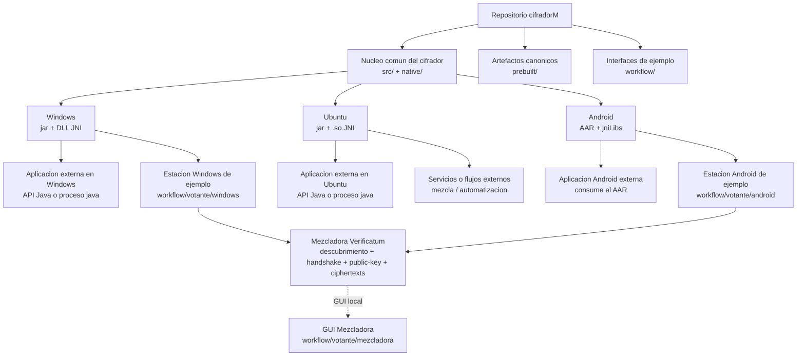

# ElGamalClient - Cifrado de Votos Electronicos

Implementacion del cifrado de votos electronicos usando ElGamal sobre curvas elipticas, con soporte multiplataforma para:

- `Windows x64`
- `Ubuntu/Linux`
- `Android`

El repositorio contiene tanto el cifrador como libreria reusable como estaciones de votacion de ejemplo que lo consumen.

## Indice

1. [Resumen](#resumen)
2. [Arquitectura](#arquitectura)
3. [Estado Actual](#estado-actual)
4. [Estructura Del Repositorio](#estructura-del-repositorio)
5. [Requisitos](#requisitos)
6. [Bootstrap De Dependencias Verificatum](#bootstrap-de-dependencias-verificatum)
7. [Artefactos Canonicos](#artefactos-canonicos)
8. [Compilacion](#compilacion)
9. [Integracion Externa Como Libreria](#integracion-externa-como-libreria)
10. [Uso Del Cifrador Desde CLI](#uso-del-cifrador-desde-cli)
11. [RNG Y Soporte De Hardware](#rng-y-soporte-de-hardware)
12. [Layout Nativo Y Carga De JNI](#layout-nativo-y-carga-de-jni)
13. [Empaquetado Y Distribucion](#empaquetado-y-distribucion)
14. [Pruebas Y Validaciones](#pruebas-y-validaciones)
15. [Consumidores De Ejemplo En Este Repo](#consumidores-de-ejemplo-en-este-repo)
16. [Resumen De Rendimiento](#resumen-de-rendimiento)
17. [Historial Breve](#historial-breve)

## Resumen

El cifrador se distribuye con filosofias distintas segun plataforma:

- `Windows` y `Ubuntu`:
  - artefacto canonico = `jar + librerias nativas JNI`
- `Android`:
  - artefacto canonico = `AAR`

La regla general del proyecto es:

- el cifrador debe poder ser consumido por cualquier interfaz externa
- las interfaces ubicadas en `workflow/` son solo consumidores de ejemplo
- ninguna aplicacion externa debe depender del codigo fuente interno del cifrador

## Arquitectura



Lectura rapida del diagrama:

- `Windows`: una app externa o la estacion de ejemplo consumen el mismo cifrador como `jar + DLL`
- `Ubuntu`: una app o servicio externo consume el mismo cifrador como `jar + .so`
- `Android`: una app externa o la estacion de ejemplo consumen el mismo cifrador como `AAR`
- la mezcladora no forma parte del cifrador; es un servicio aparte al que las estaciones de voto se conectan

## Estado Actual

Puntos principales del estado actual:

- el cifrador Java se compila con `Java 21`
- `Windows` usa `ElGamalCipher-1.1.0.jar` mas `vecj-2.2.0.dll` y `vmgj-1.3.0.dll`
- `Ubuntu` usa el mismo `jar` mas `libvecj` y `libvmgj`
- `Android` expone el cifrador como libreria reusable
- la estacion de votacion Windows consume el cifrador Windows como libreria
- la estacion de votacion Android consume el cifrador Android como libreria

## Estructura Del Repositorio

- `android/`
  - modulo Android del cifrador reusable
- `dist/`
  - artefactos finales listos para distribucion
- `docs/`
  - documentacion tecnica adicional
- `native/`
  - fuentes compartidas de `vec`, `gmpmee`, `vecj` y `vmgj`
- `prebuilt/`
  - artefactos canonicos compilados para consumo posterior
- `recursos/`
  - llaves, votos y recursos de prueba
- `scripts/`
  - scripts de compilacion, empaquetado, entorno y pruebas por plataforma
- `src/`
  - codigo Java principal del cifrador
- `tools/`
  - herramientas auxiliares separadas del flujo principal
- `workflow/`
  - estaciones de votacion y consumidores de ejemplo del cifrador
  - incluye la GUI de la mezcladora Verificatum en `workflow/votante/mezcladora`

## Requisitos

- `Java 21` o superior
- `Maven 3.x`

Requisitos adicionales por plataforma:

- `Windows`
  - PowerShell
  - `MSYS2 UCRT64` si se van a recompilar DLL JNI
- `Ubuntu`
  - toolchain nativo para JNI Linux
- `Android`
  - Android SDK / Gradle para compilar el `AAR` o el consumidor Android

## Bootstrap De Dependencias Verificatum

Las dependencias `com.verificatum` no viven en Maven Central. Este repo usa bootstrap local.

Windows:

```powershell
powershell -ExecutionPolicy Bypass -File .\scripts\windows\compilacion\bootstrap-verificatum.ps1
```

Ubuntu:

```bash
./scripts/ubuntu/entorno/bootstrap-verificatum.sh
```

Android:

- reutiliza el mismo repositorio Maven local del proyecto
- no requiere un bootstrap Verificatum separado para consumir el `AAR`
- la compilacion Android depende de que el bootstrap Maven del repo ya exista

En Windows el bootstrap instala en `.mvn/local-repo`:

- `com.verificatum:verificatum-vmgj:1.3.0`
- `com.verificatum:verificatum-vecj:2.2.0`
- `com.verificatum:verificatum-vcr-vmgj-vecj:3.1.0`

## Artefactos Canonicos

### Windows

- `prebuilt/java/ElGamalCipher-1.1.0.jar`
- `prebuilt/windows-x64/vecj-2.2.0.dll`
- `prebuilt/windows-x64/vmgj-1.3.0.dll`

Bundle de libreria distribuible:

- `dist/windows/library/Cifrador/app/ElGamalCipher-1.1.0.jar`
- `dist/windows/library/Cifrador/libs/windows-x64/vecj-2.2.0.dll`
- `dist/windows/library/Cifrador/libs/windows-x64/vmgj-1.3.0.dll`

### Ubuntu

- `prebuilt/java/ElGamalCipher-1.1.0.jar`
- `prebuilt/linux-x64/`

### Android

- `prebuilt/android/aar/ElGamalCipher-android-debug.aar`
- `prebuilt/android/jniLibs/arm64-v8a/`
- `prebuilt/android/jniLibs/x86_64/`

## Compilacion

### Compilacion Base Del Cifrador

Windows:

```powershell
powershell -ExecutionPolicy Bypass -File .\scripts\windows\compilacion\build-cifrador.ps1
```

Ubuntu:

```bash
./scripts/ubuntu/compilacion/build-cifrador.sh
```

Android:

```bash
./scripts/android/compilacion/build-cifrador.sh
```

### Compilacion Nativa Por Plataforma

Windows:

```powershell
powershell -ExecutionPolicy Bypass -File .\scripts\windows\compilacion\build-native-windows.ps1
```

Salida esperada:

- `prebuilt/windows-x64/vecj-2.2.0.dll`
- `prebuilt/windows-x64/vmgj-1.3.0.dll`

Ubuntu:

```bash
./scripts/ubuntu/compilacion/build-native-linux.sh
```

Salida esperada:

- `prebuilt/linux-x64/`

Android:

```bash
./scripts/android/compilacion/build-jni.sh
```

Salida esperada:

- `prebuilt/android/jniLibs/arm64-v8a/`
- `prebuilt/android/jniLibs/x86_64/`

## Integracion Externa Como Libreria

### Filosofia General

- `Windows` y `Ubuntu` consumen `jar + JNI`
- `Android` consume `AAR`
- el cifrador es la libreria
- las interfaces de votacion son consumidores separados

### Modos De Integracion Segun Plataforma

En `Windows` y `Ubuntu` existen dos formas validas de integracion:

- como API Java embebida dentro de una aplicacion propia
- como proceso externo lanzando `java` contra el `jar`

Ambas opciones usan el mismo cifrador y ambas siguen requiriendo las bibliotecas JNI nativas de la plataforma.

En `Android` el modelo canonico es distinto:

- la integracion se hace consumiendo el `AAR` como libreria dentro de la app Android
- no se considera un uso externo por CLI ni lanzando un proceso `java` separado
- la API publica Android vive dentro del propio `AAR`

### API Java Comun Para Windows Y Ubuntu

Esta API aplica a consumidores Java externos en `Windows` y `Ubuntu`.

No aplica directamente a `Android`, porque en Android el punto de integracion canonico es el `AAR`.

Clases principales:

- `pe.gob.onpe.votodigital.elgamalcipher.ElGamalCipherService`
- `pe.gob.onpe.votodigital.elgamalcipher.CifradorRequest`
- `pe.gob.onpe.votodigital.elgamalcipher.CifradorRngMode`
- `pe.gob.onpe.votodigital.elgamalcipher.LogConfig`

Ejemplo minimo para una aplicacion Java que luego se ejecuta en `Windows` o `Ubuntu` con las librerias JNI correctas:

```java
import java.nio.file.Path;
import java.util.logging.Level;
import java.util.logging.Logger;
import pe.gob.onpe.votodigital.elgamalcipher.CifradorRequest;
import pe.gob.onpe.votodigital.elgamalcipher.CifradorRngMode;
import pe.gob.onpe.votodigital.elgamalcipher.ElGamalCipherService;
import pe.gob.onpe.votodigital.elgamalcipher.LogConfig;

public final class DemoCifrado {
    public static void main(String[] args) {
        Logger logger = LogConfig.getLogger(
            "./logs/demo-cifrador.log",
            Level.INFO,
            true,
            true,
            true,
            true,
            true
        );

        CifradorRequest request = new CifradorRequest(
            Path.of("recursos/publicKey"),
            Path.of("recursos/shuffled_votes.txt"),
            Path.of("salida/ciphertexts_ext"),
            CifradorRngMode.SOFTWARE,
            false
        );

        boolean ok = new ElGamalCipherService(logger).encrypt(request);
        if (!ok) {
            throw new IllegalStateException("El cifrado no produjo salida.");
        }
    }
}
```

### Integracion Externa En Windows

Una aplicacion externa en Windows debe consumir:

- `ElGamalCipher-1.1.0.jar`
- `vecj-2.2.0.dll`
- `vmgj-1.3.0.dll`

Ejemplo:

```powershell
java `
  -Djava.library.path=D:\ruta\prebuilt\windows-x64 `
  -cp D:\ruta\prebuilt\java\ElGamalCipher-1.1.0.jar;mi-app.jar `
  com.ejemplo.Main
```

Importante:

- el artefacto canonico Windows es libreria, no `.exe`
- no copies solo el `jar`; copia tambien las DLL JNI

### Integracion Externa En Ubuntu

Una aplicacion externa en Ubuntu debe enlazar el `jar` y exponer `libvecj` y `libvmgj`.

Ejemplo:

```bash
java \
  -Djava.library.path=/ruta/al/proyecto/prebuilt/linux-x64 \
  -cp /ruta/al/proyecto/prebuilt/java/ElGamalCipher-1.1.0.jar:mi-app.jar \
  com.ejemplo.Main
```

### Integracion Externa En Android

En `Android` no se usa el cifrador como proceso externo ni como CLI independiente.

La forma correcta de integracion es consumir el `AAR` compilado dentro de la app Android, es decir, usar la API publica del cifrador como libreria embebida:

```kotlin
dependencies {
    implementation(files("/ruta/al/proyecto/prebuilt/android/aar/ElGamalCipher-android-debug.aar"))
}
```

API Android principal:

- `pe.gob.onpe.votodigital.cifrador.android.AndroidCipherRunner`
- `pe.gob.onpe.votodigital.cifrador.android.AndroidCipherLibraryInfo`
- `pe.gob.onpe.votodigital.cifrador.android.AndroidTrueRngSupport`

El `AAR` ya empaqueta:

- bridge Android
- `jniLibs` para `arm64-v8a`
- `jniLibs` para `x86_64`
- soporte TrueRNG USB para Android

Resumen por plataforma:

- `Windows`: usa la API Java comun mas `jar + DLL`
- `Ubuntu`: usa la API Java comun mas `jar + .so`
- `Android`: usa el `AAR` y su API Android publica

## Uso Del Cifrador Desde CLI

Ejecucion base:

```bash
java -jar prebuilt/java/ElGamalCipher-1.1.0.jar \
     <ruta_publicKey> \
     <ruta_votos_planos> \
     <ruta_salida_cifrados> \
     -sw \
     [-p]
```

Parametros:

1. `public_Key_file_name`: ruta a la llave publica
2. `plain_votes_file_name`: archivo con votos planos
3. `ciphered_votes_file_name`: salida `ciphertexts_ext`
4. `-sw` o `-hw`: modalidad RNG
5. `-p`: barra de progreso opcional

## RNG Y Soporte De Hardware

### Ubuntu

- `-sw` usa `RandomDevice()` con `/dev/urandom`
- `-hw` usa TrueRNG por:
  - propiedad JVM `-Delgamal.rng.device=<ruta>`
  - variable `ELGAMAL_RNG_DEVICE`
  - valor por defecto `/dev/TrueRNG0`

### Windows

- `-sw` usa `SecureRandom`
- `-hw` usa TrueRNG por:
  - autodeteccion `VID:PID 04D8:F5FE`
  - propiedad JVM `-Delgamal.rng.device=COMx`
  - variable `ELGAMAL_RNG_DEVICE=COMx`

### Android

- `-sw` usa `SecureRandom`
- `-hw` usa TrueRNG USB cuando el dispositivo esta conectado por OTG, Android detecta un driver serial compatible y la app ya tiene permiso USB
- el `AAR` ya incluye `AndroidTrueRngSupport` y `AndroidUsbTrueRngRandomSource`; no hace falta que la app consumidora implemente por su cuenta la lectura del TrueRNG
- si no hay dispositivo, driver o permiso USB, la ejecucion en modo hardware falla de forma explicita; no se degrada silenciosamente a `SecureRandom`
- la app consumidora si debe manejar permisos USB, diagnostico del dispositivo y ciclo de vida Android alrededor del uso del TrueRNG

### Otros Sistemas

- `-sw` y `-hw` usan `SecureRandom`

## Layout Nativo Y Carga De JNI

La aplicacion busca bibliotecas nativas en este orden:

1. `prebuilt/<os-arch>`
2. `prebuilt`
3. `libs/<os-arch>`
4. `libs`

Ejemplos:

- `prebuilt/linux-x64/libvecj-2.2.0.so`
- `prebuilt/windows-x64/vecj-2.2.0.dll`

Si el `jar` se ejecuta sin `java.library.path` y encuentra un layout local valido, puede relanzarse con la ruta correcta.

## Empaquetado Y Distribucion

### Windows

Build del bundle de libreria:

```powershell
powershell -ExecutionPolicy Bypass -File .\scripts\windows\empaquetado\build-cifrador-portable.ps1
```

Salida:

- `dist/windows/library/Cifrador/app/ElGamalCipher-1.1.0.jar`
- `dist/windows/library/Cifrador/libs/windows-x64/vecj-2.2.0.dll`
- `dist/windows/library/Cifrador/libs/windows-x64/vmgj-1.3.0.dll`

ZIP del bundle:

```powershell
powershell -ExecutionPolicy Bypass -File .\scripts\windows\empaquetado\package-cifrador-portable.ps1
```

Salida:

- `dist/windows/Cifrador-1.1.0-windows-x64-library.zip`

### Ubuntu

Imagen portable:

```bash
./scripts/ubuntu/empaquetado/build-cifrador-portable.sh
```

Salida:

- `dist/linux/image/Cifrador/Cifrador`
- `dist/linux/image/Cifrador/runtime`
- `dist/linux/image/Cifrador/app`
- `dist/linux/image/Cifrador/libs/linux-x64`

Paquete comprimido:

```bash
./scripts/ubuntu/empaquetado/package-cifrador-portable.sh
```

Salida:

- `dist/linux/Cifrador-1.1.0-linux-x64-portable.tar.gz`

### Android

Imagen portable:

```bash
./scripts/android/empaquetado/build-cifrador-portable.sh
```

Salida:

- `dist/android/image/Cifrador/aar/Cifrador-android-debug.aar`
- `dist/android/image/Cifrador/jniLibs/arm64-v8a/`
- `dist/android/image/Cifrador/jniLibs/x86_64/`
- `dist/android/image/Cifrador/metadata/checksums.sha256`

Paquete comprimido:

```bash
./scripts/android/empaquetado/package-cifrador-portable.sh
```

Salida:

- `dist/android/Cifrador-1.1.0-android-portable.zip`

## Pruebas Y Validaciones

### Windows Contra Verificatum Linux

Prueba remota automatizada:

```powershell
powershell -NoProfile -ExecutionPolicy Bypass -File .\scripts\windows\pruebas\test-remote-verificatum-mix.ps1 `
    -SshHost <host-verificatum> `
    -Password "<password-ssh>" `
    -RebuildBundle
```

Wrapper `.bat`:

```bat
.\scripts\windows\pruebas\test-remote-verificatum-mix.bat -Password "<password-ssh>" -SshHost <host-verificatum>
```

Resultado esperado:

- `ciphertexts_ext` generado localmente
- `shuffle`, `decrypt` y `vmnv` completados en Linux
- comparación final consistente entre originales y descifrados

### Android

Scripts relevantes:

- `scripts/android/pruebas/test-connected.sh`
- `scripts/android/pruebas/test-hybrid-mix.sh`

### Ubuntu

Validaciones relevantes:

- `scripts/ubuntu/entorno/bootstrap-verificatum.sh`
- `scripts/ubuntu/compilacion/build-cifrador.sh`
- `scripts/ubuntu/ejecucion/run-cifrador.sh`
- `scripts/ubuntu/empaquetado/build-cifrador-portable.sh`

## Consumidores De Ejemplo En Este Repo

### Votante Windows

- codigo: `workflow/votante/windows`
- consume el cifrador Windows como libreria
- empaqueta su propio runtime Java
- no depende de `Cifrador.exe`

### Votante Android

- codigo: `workflow/votante/android`
- consume el cifrador Android como libreria
- la interfaz en este repo es solo un ejemplo de uso

### GUI Mezcladora Verificatum

- codigo: `workflow/votante/mezcladora`
- GUI web local para operar varias `parties` de Verificatum en una sola PC
- expone panel principal en el puerto `7040` y una ventana por `party` en `70xx`
- las estaciones de voto (`windows`, `android`) se conectan a esta mezcladora via su API REST
- arranque: `cd workflow/votante/mezcladora && ./start_gui.sh`

### Ubuntu

- no hay una estacion de votacion Ubuntu en `workflow/`
- Ubuntu se usa en este repositorio como entorno de ejecucion CLI, empaquetado y validacion tecnica del cifrador

## Resumen De Rendimiento

Prueba de referencia con `10,000` votos:

| Metrica | Version Original | Version Optimizada | Mejora |
| :--- | :---: | :---: | :---: |
| Tiempo de ejecucion | ~1m 22s | ~10s | ~8x |
| Uso de CPU | un nucleo | multi-nucleo | mejora sustancial |

Mejoras clave:

- paralelismo con streams
- `ThreadLocal<RandomSource>`
- barra de progreso opcional
- control de modo hardware para TrueRNG

## Historial Breve

### Version 1.1.0

- refactor para calidad de codigo
- uso de capacidades modernas de Java 21
- mejoras de logs, estructura y portabilidad

### Version 1.0.0

- optimizacion de rendimiento
- paralelismo y mejora del acceso al RNG

### Rama `cifradorM`

- soporte multiplataforma
- empaquetado nativo por plataforma
- consolidacion del cifrador como libreria reusable
