# ElGamalClient - Cifrado de Votos Electronicos

Implementacion del cifrado de votos electronicos usando ElGamal sobre curvas elipticas, con soporte multiplataforma para:

- `Windows x64`
- `Ubuntu/Linux`
- `Android`

El repositorio contiene tanto el cifrador como libreria reusable como estaciones de votacion de ejemplo que lo consumen.

## Indice

1. [Resumen](#resumen)
2. [Arquitectura](#arquitectura)
3. [Estado Actual](#estado-actual)
4. [Estructura Del Repositorio](#estructura-del-repositorio)
5. [Requisitos](#requisitos)
6. [Windows](#windows)
   - [Guia Rapida Para Compilacion Del Cifrador](#guia-rapida-para-compilacion-del-cifrador)
   - [Guia Rapida: Levantar Estaciones Y Mezcladora](#guia-rapida-levantar-estaciones-y-mezcladora)
     - [Flujo Completo De Operacion](#9-flujo-completo-de-operacion)
   - [Anexo Windows](#anexo-windows)
7. [Ubuntu](#ubuntu)
   - [Guia Rapida Para Compilacion Del Cifrador En Ubuntu](#guia-rapida-para-compilacion-del-cifrador-en-ubuntu)
   - [Guia Rapida: Mezcla Y Verificacion Del Cifrador Por CLI](#guia-rapida-mezcla-y-verificacion-del-cifrador-por-cli)
     - [Flujo Completo De Operacion (Ubuntu)](#flujo-completo-de-operacion-ubuntu)
   - [Anexo Ubuntu](#anexo-ubuntu)
8. [Android](#android)
   - [Guia Rapida Para Compilacion Del Cifrador En Android](#guia-rapida-para-compilacion-del-cifrador-en-android)
   - [Guia Rapida: Levantar Estacion Android Y Mezcladora](#guia-rapida-levantar-estacion-android-y-mezcladora)
     - [Flujo Completo De Operacion (Android)](#5-prueba-operativa)
   - [Anexo Android](#anexo-android)
9. [Resumen De Rendimiento](#resumen-de-rendimiento)
10. [Historial Breve](#historial-breve)

## Resumen

El cifrador se distribuye con filosofias distintas segun plataforma:

- `Windows` y `Ubuntu`:
  - artefacto canonico = `jar + librerias nativas JNI`
- `Android`:
  - artefacto canonico = `AAR`

La regla general del proyecto es:

- el cifrador debe poder ser consumido por cualquier interfaz externa
- las interfaces ubicadas en `workflow/` son solo consumidores de ejemplo
- ninguna aplicacion externa debe depender del codigo fuente interno del cifrador

## Arquitectura

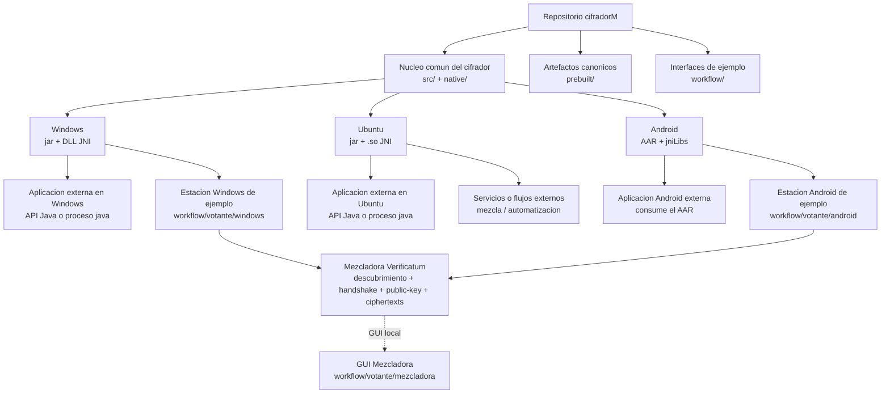

Lectura rapida del diagrama:

- `Windows`: una app externa o la estacion de ejemplo consumen el mismo cifrador como `jar + DLL`
- `Ubuntu`: una app o servicio externo consume el mismo cifrador como `jar + .so`
- `Android`: una app externa o la estacion de ejemplo consumen el mismo cifrador como `AAR`
- la mezcladora no forma parte del cifrador; es un servicio aparte al que las estaciones de voto se conectan

## Estado Actual

Puntos principales del estado actual:

- el cifrador Java se compila con `Java 21`
- `Windows` usa `ElGamalCipher-1.1.0.jar` mas `vecj-2.2.0.dll` y `vmgj-1.3.0.dll`
- `Ubuntu` usa el mismo `jar` mas `libvecj` y `libvmgj`
- `Android` expone el cifrador como libreria reusable
- la estacion de votacion Windows consume el cifrador Windows como libreria
- la estacion de votacion Android consume el cifrador Android como libreria

## Estructura Del Repositorio

- `android/`
  - modulo Android del cifrador reusable
- `dist/`
  - artefactos finales listos para distribucion
- `docs/`
  - documentacion tecnica adicional
- `native/`
  - `verificatum-jars/` repositorio Maven file-based con JARs precompilados de Verificatum (resuelto automaticamente por Maven y Gradle)
  - `verificatum-src/` fuentes de `vcr`, `vec`, `gmpmee`, `vecj` y `vmgj` (solo necesarios si se quiere recompilar desde cero)
- `prebuilt/`
  - artefactos canonicos compilados para consumo posterior
- `recursos/`
  - llaves, votos y recursos de prueba
- `scripts/`
  - scripts de compilacion, empaquetado, entorno y pruebas por plataforma
- `src/`
  - codigo Java principal del cifrador
- `tools/`
  - herramientas auxiliares separadas del flujo principal
- `workflow/`
  - estaciones de votacion y consumidores de ejemplo del cifrador
  - incluye la GUI de la mezcladora Verificatum en `workflow/votante/mezcladora`

## Requisitos

- `Java 21` o superior
- `Maven 3.x` (opcional: el proyecto incluye Maven Wrapper `mvnw` / `mvnw.cmd`)

Requisitos adicionales por plataforma:

- `Windows`
  - PowerShell
  - `MSYS2 UCRT64` si se van a recompilar DLL JNI
- `Ubuntu`
  - toolchain nativo para JNI Linux
- `Android`
  - Android SDK / Gradle para compilar el `AAR` o el consumidor Android

## Windows

### Guia Rapida Para Compilacion Del Cifrador

Ruta unica recomendada para instalar, probar y desplegar en `Windows 10 y 11`:

- use `PowerShell`
- en la primera ejecucion, abra PowerShell como administrador
- mantenga acceso a Internet para instalar `Git`, `Java 21`, `Maven Wrapper` y `MSYS2 UCRT64`

Instalacion minima de dependencias y descarga del repo:

Comprobacion minima de `winget`:

```powershell
Get-Command winget -All
where.exe winget
Test-Path "$env:LOCALAPPDATA\Microsoft\WindowsApps\winget.exe"
```

Resultado esperado:

- `Get-Command winget -All` encuentra el comando
- `where.exe winget` devuelve una ruta valida

Si `Get-Command winget -All` falla, pero `Test-Path "$env:LOCALAPPDATA\Microsoft\WindowsApps\winget.exe"` devuelve `True`, configure `PATH` asi:

```powershell
$env:Path += ";$env:LOCALAPPDATA\Microsoft\WindowsApps"
winget --version
```

Si `winget --version` ya responde, deje el cambio permanente:

```powershell
[Environment]::SetEnvironmentVariable(
  "Path",
  [Environment]::GetEnvironmentVariable("Path","User") + ";$env:LOCALAPPDATA\Microsoft\WindowsApps",
  "User"
)
```

Luego cierre PowerShell y abra una nueva consola antes de continuar.

Verificacion directa opcional:

```powershell
& "$env:LOCALAPPDATA\Microsoft\WindowsApps\winget.exe" --version
```

Si ese comando directo funciona, el problema era solo el `PATH`.

Una vez que `winget` responda correctamente, instale dependencias base y descargue la rama `cifradorM` asi:

```powershell
winget install --id Git.Git -e --accept-package-agreements --accept-source-agreements
winget install --id Microsoft.OpenJDK.21 -e --accept-package-agreements --accept-source-agreements

# Cierre esta consola y abra otra ventana de PowerShell antes de continuar.

git clone -b cifradorM https://github.com/rmartinezch/ElGamalClient.git C:\cifradorM
cd C:\cifradorM
```

Si ya tenia una version anterior de Java (por ejemplo Java 11), el `PATH` del sistema puede seguir apuntando a ella. Para forzar que la sesion actual use Java 21, ejecute:

```powershell
$jdk21 = Get-ChildItem "C:\Program Files\Microsoft\jdk-21*" -Directory | Select-Object -First 1
$env:JAVA_HOME = $jdk21.FullName
$env:PATH = "$env:JAVA_HOME\bin;$env:PATH"
```

Para que el cambio sea permanente (sobreviva al cerrar la terminal):

```powershell
[System.Environment]::SetEnvironmentVariable("JAVA_HOME", $jdk21.FullName, "User")
```

Comprobaciones minimas del entorno instalado:

```powershell
git --version
javac -version
java -version
Test-Path C:\cifradorM
```

Resultado esperado:

- `git --version` responde sin error
- `javac -version` y `java -version` muestran `21`
- `Test-Path C:\cifradorM` devuelve `True`

Si `javac -version` o `git --version` no responden despues de instalar con `winget`, cierre y abra una nueva consola PowerShell antes de continuar.

Si ya tiene el repo descargado en otra ruta, muevalo o vuelva a clonarlo en `C:\cifradorM`.

Comprobaciones minimas del repo clonado:

```powershell
cd C:\cifradorM
git branch --show-current
git remote get-url origin
Test-Path .\native\verificatum-src\verificatum-vcr-3.1.0
Test-Path .\native\verificatum-src\verificatum-vecj-2.2.0
Test-Path .\native\verificatum-jars\com\verificatum\verificatum-vmgj\1.3.0\verificatum-vmgj-1.3.0.jar
```

Resultado esperado:

- `git branch --show-current` devuelve `cifradorM`
- `git remote get-url origin` devuelve `https://github.com/rmartinezch/ElGamalClient.git`
- los tres `Test-Path` devuelven `True`

Recompilacion minima de todos los artefactos Windows (`jar + DLL JNI`):

```powershell
cd C:\cifradorM
powershell -ExecutionPolicy Bypass -File .\scripts\windows\compilacion\build-cifrador.ps1 `
  -MavenCmd C:\cifradorM\mvnw.cmd `
  -ForceNativeBuild
```

Comprobaciones minimas del build:

```powershell
Test-Path .\prebuilt\java\ElGamalCipher-1.1.0.jar
Test-Path .\prebuilt\windows-x64\vecj-2.2.0.dll
Test-Path .\prebuilt\windows-x64\vmgj-1.3.0.dll
Get-Item .\prebuilt\java\ElGamalCipher-1.1.0.jar
Get-Item .\prebuilt\windows-x64\vecj-2.2.0.dll
Get-Item .\prebuilt\windows-x64\vmgj-1.3.0.dll
```

Resultado esperado:

- los tres `Test-Path` devuelven `True`
- `Get-Item` muestra fecha y tamaño de archivos recientes en `prebuilt\java` y `prebuilt\windows-x64`

Este flujo:

- recompila el JAR principal del cifrador
- fuerza la regeneracion de `vecj-2.2.0.dll` y `vmgj-1.3.0.dll`
- ejecuta `bootstrap-verificatum.ps1` automaticamente si faltan artefactos de Verificatum en el repo local
- instala y actualiza `MSYS2 UCRT64` automaticamente si hace falta para la compilacion nativa

Artefactos recompilados para despliegue:

- `C:\cifradorM\prebuilt\java\ElGamalCipher-1.1.0.jar`
- `C:\cifradorM\prebuilt\windows-x64\vecj-2.2.0.dll`
- `C:\cifradorM\prebuilt\windows-x64\vmgj-1.3.0.dll`

Prueba minima por CLI:

```powershell
java -jar "C:\cifradorM\prebuilt\java\ElGamalCipher-1.1.0.jar" `
  'C:\cifradorM\recursos\publicKey' `
  'C:\cifradorM\recursos\shuffled_votes.txt' `
  'C:\cifradorM\recursos\ciphertexts_ext' `
  -sw `
  -p
```

Si el uso final es desde otra aplicacion Java en Windows, despliegue siempre el `jar`
junto con ambas DLL del directorio `prebuilt\windows-x64`.

JARs incluidos en `native/verificatum-jars/`:

| Artefacto | Version | Tamaño |
|-----------|---------|--------|
| `verificatum-vcr-vmgj-vecj` | 3.1.0 | 1.7 MB |
| `verificatum-vecj` | 2.2.0 | 6.8 KB |
| `verificatum-vmgj` | 1.3.0 | 9.8 KB |

Fuentes incluidos en `native/verificatum-src/`:

| Paquete | Version | Uso |
|---------|---------|-----|
| `verificatum-vcr` | 3.1.0 | Solo si se necesita recompilar VCR desde fuentes |
| `verificatum-vecj` | 2.2.0 | Solo si se necesita recompilar VECJ desde fuentes |
| `verificatum-vmgj` | 1.3.0 | Solo si se necesita recompilar VMGJ desde fuentes |
| `verificatum-gmpmee` | 2.1.0 | Dependencia nativa de VCR |
| `verificatum-vec` | 2.5.0 | Dependencia nativa de VECJ |

### Guia Rapida: Levantar Estaciones Y Mezcladora

Esta es la ruta minima para:

1. generar la estacion Windows portable
2. descomprimirla en `C:\`
3. levantar la mezcladora en `WSL`
4. abrir la estacion Windows contra la mezcladora local

Supuestos de esta ruta:

- el repo ya existe en `C:\cifradorM`
- la mezcladora correra en la misma PC Windows dentro de `WSL`
- la estacion Windows se ejecutara desde `C:\VotanteWindowsPortable`

#### 1. Verificar Java 21 para empaquetar la estacion

En `PowerShell`:

```powershell
javac -version
```

Si `javac` no existe o muestra una version menor a `21`, instale `Java 21`:

```powershell
winget install --id Microsoft.OpenJDK.21 -e --accept-package-agreements --accept-source-agreements
```

#### 2. Generar el portable Windows

```powershell
cd C:\cifradorM
powershell -ExecutionPolicy Bypass -File .\workflow\votante\windows\package-votante-windows-portable.ps1
Test-Path .\dist\windows\VotanteWindowsPortable.zip
```

Resultado esperado:

- el ultimo comando devuelve `True`
- existe `C:\cifradorM\dist\windows\VotanteWindowsPortable.zip`

#### 3. Descomprimir la estacion Windows en `C:\`

En `PowerShell`:

```powershell
Remove-Item -Recurse -Force C:\VotanteWindowsPortable -ErrorAction SilentlyContinue
Expand-Archive -LiteralPath C:\cifradorM\dist\windows\VotanteWindowsPortable.zip -DestinationPath C:\VotanteWindowsPortable -Force
```

Comprobacion minima:

```powershell
Test-Path C:\VotanteWindowsPortable\run-votante-windows.cmd
Test-Path C:\VotanteWindowsPortable\runtime\java\bin\java.exe
```

Resultado esperado:

- ambos comandos devuelven `True`

#### 4. Verificar WSL y Ubuntu

En `PowerShell`:

```powershell
wsl --status
```

Si `WSL` o `Ubuntu` no estan instalados, en `PowerShell` como administrador:

```powershell
wsl --install -d Ubuntu
```

Despues reinicie Windows si el sistema lo solicita y abra una nueva consola.

Si despues del reinicio `wsl --status` muestra mensajes como estos:

- `WSL2 no es compatible con la configuracion actual de la maquina`
- `Se debe habilitar el componente opcional "Plataforma de maquina virtual"`
- `Habilita el componente opcional "Subsistema de Windows para Linux"`

habilite manualmente las features requeridas en `PowerShell` como administrador:

```powershell
dism.exe /online /enable-feature /featurename:Microsoft-Windows-Subsystem-Linux /all /norestart
dism.exe /online /enable-feature /featurename:VirtualMachinePlatform /all /norestart
bcdedit /set hypervisorlaunchtype auto
shutdown /r /t 0
```

Despues del reinicio, vuelva a comprobar:

```powershell
wsl --status
wsl --set-default-version 2
```

Comprobacion opcional de las features:

```powershell
Get-WindowsOptionalFeature -Online -FeatureName Microsoft-Windows-Subsystem-Linux
Get-WindowsOptionalFeature -Online -FeatureName VirtualMachinePlatform
```

Resultado esperado:

- ambas features quedan en estado `Enabled`
- `wsl --status` ya no muestra errores de compatibilidad para `WSL2`

Si al intentar entrar a Ubuntu aparece:

- `No hay ninguna distribucion con el nombre proporcionado`
- `WSL_E_DISTRO_NOT_FOUND`

liste las distribuciones instaladas:

```powershell
wsl -l -v
```

Si `Ubuntu` no aparece en la lista, instale la distribucion:

```powershell
wsl --install -d Ubuntu
```

Si la instalacion ya existe pero quedo a medio configurar, puede abrirla asi:

```powershell
wsl -d Ubuntu
```

Si `wsl -d Ubuntu` sigue fallando, reinicie Windows y vuelva a ejecutar:

```powershell
wsl --install -d Ubuntu
```

#### 5. Verificar dependencias minimas de la mezcladora en WSL

En `PowerShell`:

```powershell
wsl -d Ubuntu -- bash -lc "python3 --version && command -v vmn vmni vmnc vmnd vog"
```

Si falta `python3`, instale paquetes base:

```powershell
wsl -d Ubuntu -- bash -lc "sudo apt update && sudo apt install -y python3 python3-venv python3-pip"
```

Si faltan `vmn`, `vmni`, `vmnc`, `vmnd` o `vog`, instale Verificatum:

```powershell
wsl -d Ubuntu -- bash -lc "sudo apt-get update && sudo apt-get install --yes m4 cpp gcc make libtool automake autoconf libgmp-dev openjdk-21-jdk wget"
wsl -d Ubuntu -- bash -lc "cd ~ && wget https://github.com/rmartinezch/mixnet/raw/main/installer/verificatum-vmn-3.1.0-full.tar.gz && mkdir -p verificatum-vmn-3.1.0-full && tar xvfz verificatum-vmn-3.1.0-full.tar.gz -C verificatum-vmn-3.1.0-full && cd verificatum-vmn-3.1.0-full && sudo make install"
```

Comprobacion minima despues de instalar Verificatum:

```powershell
wsl -d Ubuntu -- bash -lc "vmn -version && command -v vmn vmni vmnc vmnd vog"
wsl -d Ubuntu -- bash -lc "vog -rndinit RandomDevice /dev/urandom"
```

Resultado esperado:

- `vmn -version` responde sin error
- `command -v vmn vmni vmnc vmnd vog` devuelve rutas validas
- `vog -rndinit RandomDevice /dev/urandom` responde sin error

Si esa comprobacion falla, no continue con `start_gui.sh` hasta corregir la instalacion de Verificatum.

Vuelva a comprobar:

```powershell
wsl -d Ubuntu -- bash -lc "python3 --version && command -v vmn vmni vmnc vmnd vog"
```

#### 6. Levantar y publicar la mezcladora en WSL

En `PowerShell`:

```powershell
wsl -d Ubuntu -- bash -lc "cd /mnt/c/cifradorM/workflow/votante/mezcladora && ./start_gui.sh"
cd C:\cifradorM
powershell -ExecutionPolicy Bypass -File .\workflow\votante\mezcladora\scripts\configure_windows_portproxy.ps1
```

Si aparece este error:

- `/usr/bin/env: 'bash\r': No such file or directory`

convierta el script a finales de linea Linux y vuelva a ejecutar:

```powershell
wsl -d Ubuntu -- bash -lc "sed -i 's/\r$//' /mnt/c/cifradorM/workflow/votante/mezcladora/start_gui.sh"
wsl -d Ubuntu -- bash -lc "cd /mnt/c/cifradorM/workflow/votante/mezcladora && ./start_gui.sh"
```

Resultado esperado:

- la GUI queda publicada en `http://127.0.0.1:7040`
- las parties usan `7041` a `7049`
- Windows publica `7040-7049` hacia la IP actual de `WSL`

#### 7. Levantar la estacion Windows

En otra consola `PowerShell`:

```powershell
cd C:\VotanteWindowsPortable
powershell -ExecutionPolicy Bypass -File .\run-votante-windows.ps1 -ServiceBaseUrl http://127.0.0.1:7040
```

Resultado esperado:

- la cabina queda disponible en `http://127.0.0.1:8788`
- la estacion intenta descubrir la mezcladora desde `http://127.0.0.1:7040`

#### 8. Verificacion final

Abra:

- `http://127.0.0.1:7040`
- `http://127.0.0.1:8788`

La ruta minima queda operativa cuando:

- la mezcladora responde en `7040`
- la estacion responde en `8788`
- la estacion muestra conexion correcta a la mezcladora

#### 9. Flujo completo de operacion

Una vez que la mezcladora y la estacion estan levantadas, el flujo de operacion
es el siguiente:

```mermaid
flowchart TD
    classDef mezcladora fill:#1a73e8,stroke:#0d47a1,color:#fff,font-weight:bold
    classDef estacion fill:#34a853,stroke:#1b5e20,color:#fff,font-weight:bold
    classDef party fill:#f9ab00,stroke:#e65100,color:#000,font-weight:bold
    classDef espera fill:#e8eaed,stroke:#9aa0a6,color:#333
    classDef resultado fill:#ea4335,stroke:#b71c1c,color:#fff,font-weight:bold

    subgraph FASE1["FASE 1 — Creacion de Sesion y Llave"]
        M1["Mezcladora<br/>http://127.0.0.1:7040"]:::mezcladora
        M2["Click en Nueva Sesion"]:::mezcladora
        M3["Generando llave criptografica<br/>(keygen entre 3 parties)"]:::espera
        M4["Llave creada<br/>Estado: Esperando votos"]:::mezcladora
        M1 --> M2 --> M3 --> M4
    end

    subgraph FASE2["FASE 2 — Emision de Voto"]
        E1["Estacion de Voto<br/>http://127.0.0.1:8788"]:::estacion
        E2["Handshake automatico<br/>+ descarga de llave publica"]:::estacion
        E3["Click en Emitir Voto<br/>El voto se cifra y envia"]:::estacion
        E1 --> E2 --> E3
    end

    subgraph FASE3["FASE 3 — Mezcla de Votos"]
        MR["Mezcladora<br/>Voto recibido"]:::mezcladora
        P1M["Party 1 - Click en Mezclar"]:::party
        P2M["Party 2 - Click en Mezclar"]:::party
        P3M["Party 3 - Click en Mezclar"]:::party
        MW["Mezclando votos..."]:::espera
        MD["Mezcla completada<br/>Listo para descifrado"]:::mezcladora
        MR --> P1M --> P2M --> P3M --> MW --> MD
    end

    subgraph FASE4["FASE 4 — Descifrado de Votos"]
        P1D["Party 1 - Click en Descifrar"]:::party
        P2D["Party 2 - Click en Descifrar"]:::party
        P3D["Party 3 - Click en Descifrar"]:::party
        DW["Descifrando votos..."]:::espera
        DD["Descifrado completado"]:::mezcladora
        MD --> P1D --> P2D --> P3D --> DW --> DD
    end

    subgraph FASE5["FASE 5 — Descarga y Validacion"]
        DL["Cualquier Party<br/>Descargar votos descifrados"]:::party
        VL["Validar que el cifrador cifro<br/>correctamente desde el inicio<br/>y la mezcladora lo demostro"]:::resultado
        DD --> DL --> VL
    end

    M4 --> E1
    E3 --> MR
```

##### Fase 1 — Creacion de sesion y llave (mezcladora)

Abra `http://127.0.0.1:7040` y haga click en **Nueva sesion y ejecutar keygen**.
El formulario permite configurar la etiqueta, nombre de eleccion, SID, host,
numero de parties y umbral minimo.

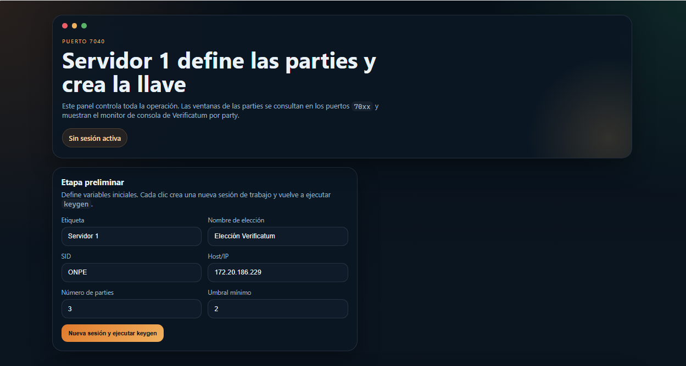

La mezcladora ejecuta el keygen distribuido entre las 3 parties. Cuando termine,
aparece la **Sesion activa** con el ID de sesion, rutas de llaves publicas y
las ventanas de cada party con estado `ok`.

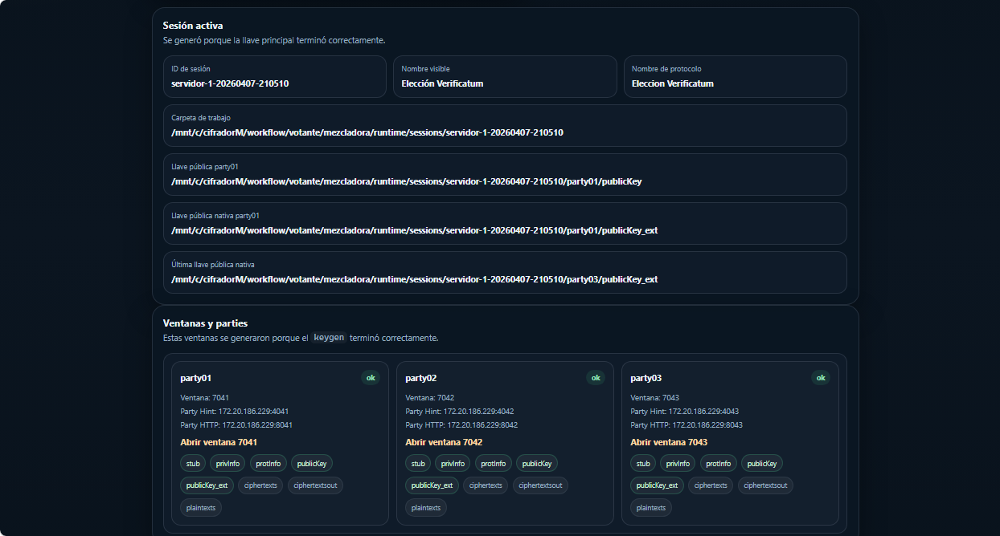

En la parte inferior se muestra el **Monitor general** con los logs de keygen
completado en todas las parties.

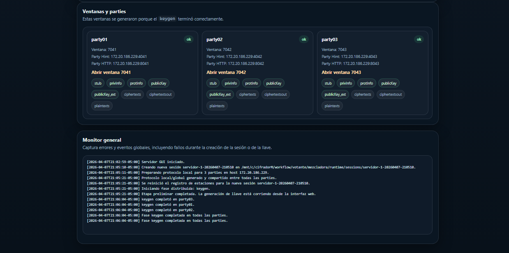

##### Fase 2 — Emision de voto (estacion)

Abra `http://127.0.0.1:8788`. La estacion realiza el handshake automatico
y descarga la llave publica de la mezcladora. El panel **Estado Operativo**
muestra Mezcladora: `Activa`, Llave: `Disponible`.

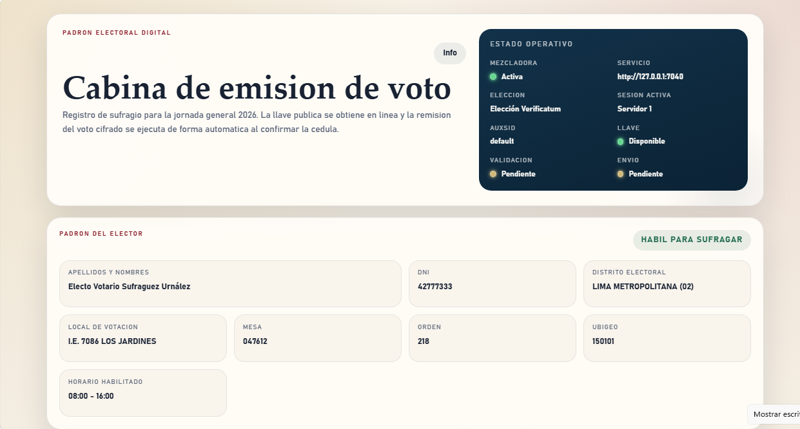

En la **Cedula de votacion** seleccione las opciones para cada eleccion
(Formula presidencial, Senadores, Diputados, Parlamento Andino) y haga click
en **Emitir voto cifrado**.

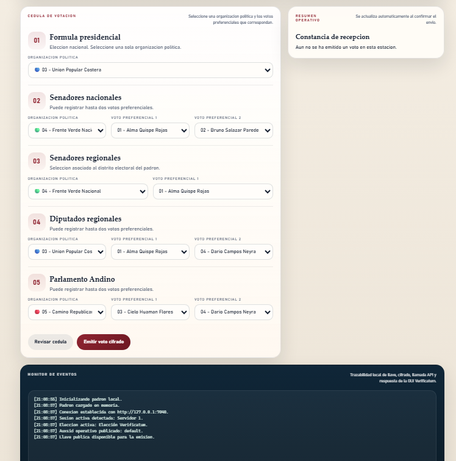

Despues de emitir, aparece la **Constancia de recepcion** con el Run ID,
estado `Confirmada` y el detalle de la operacion. El monitor de eventos
muestra todo el proceso de cifrado y envio.

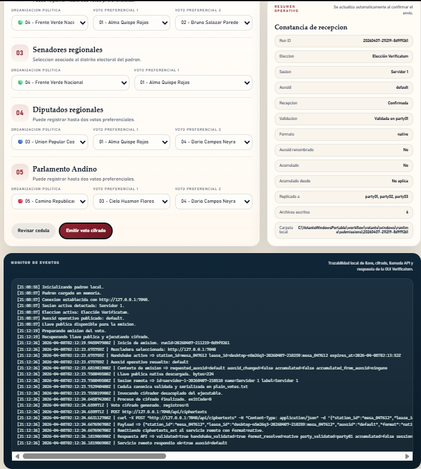

##### Fase 3 — Mezcla de votos (mezcladora)

Una vez recibido el voto, el monitor de la mezcladora muestra el handshake
aceptado y los ciphertexts validados y cargados via API.

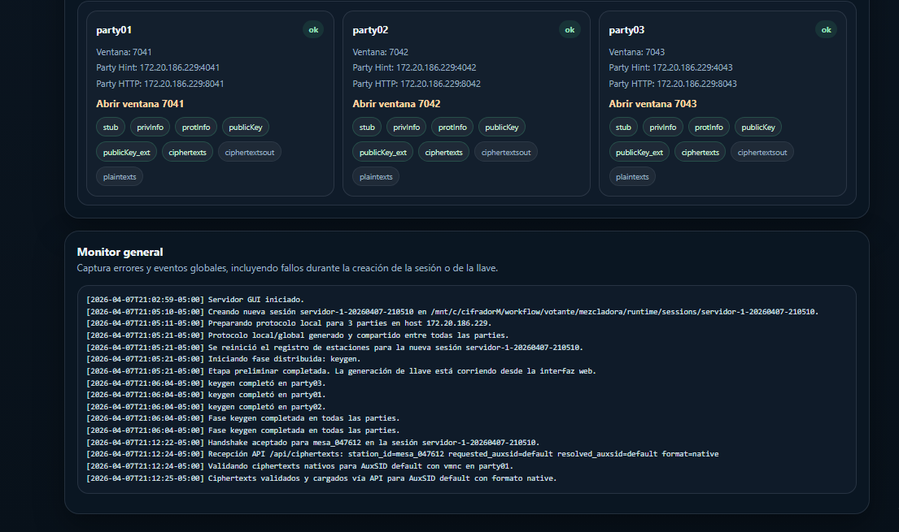

Abra la ventana de cada party (links **Abrir ventana 7041/7042/7043**) y
en cada una haga click en **Mezclar**:

1. **Party 1** → click en **Mezclar**
2. **Party 2** → click en **Mezclar**
3. **Party 3** → click en **Mezclar**

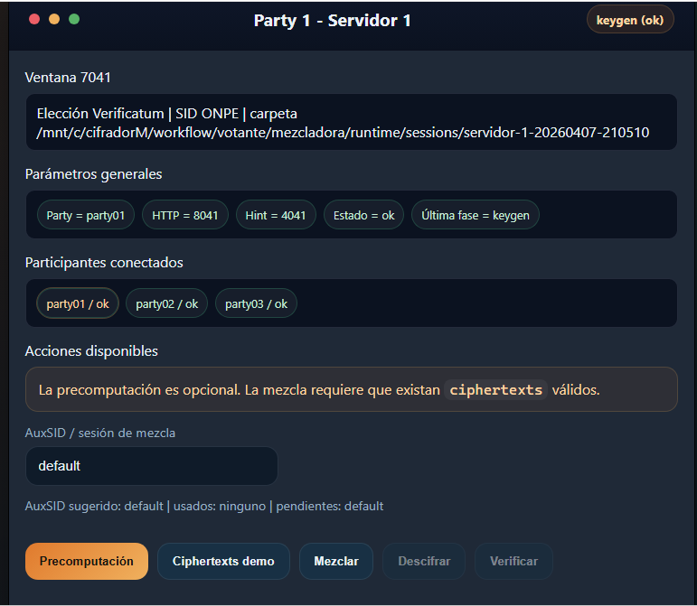

Despues de que todas las parties completen el shuffle, el estado cambia a
`shuffle (ok)` y el boton **Descifrar** se habilita.

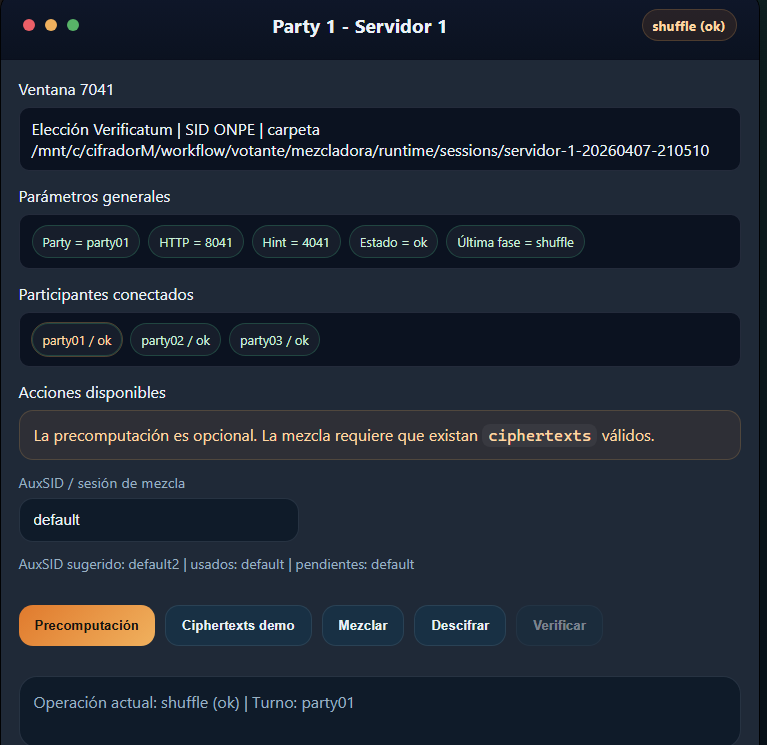

El **Estado secuencial por fase** muestra Mezclado: `completada` y
Descifrado: `mi turno`.

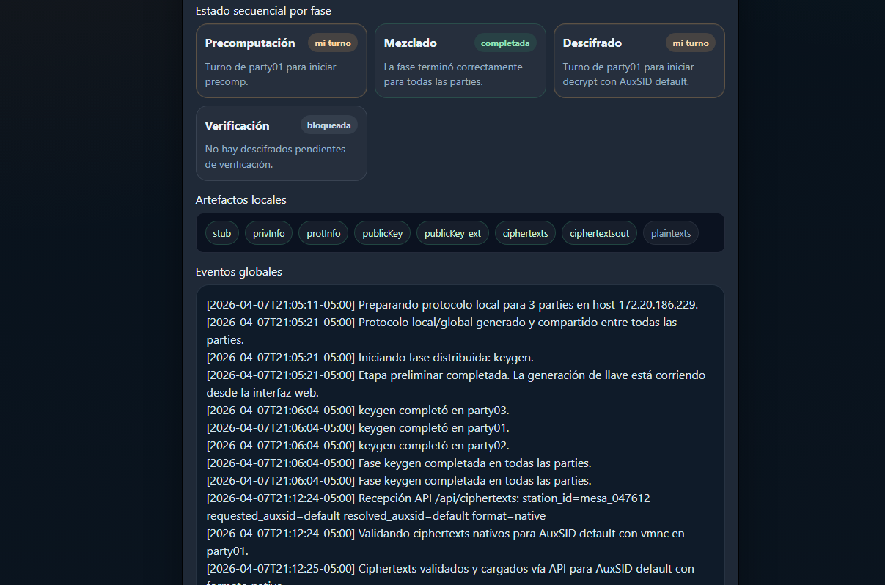

El **Monitor de eventos** muestra el detalle del proceso `vmn -shuffle`
ejecutado por Verificatum.

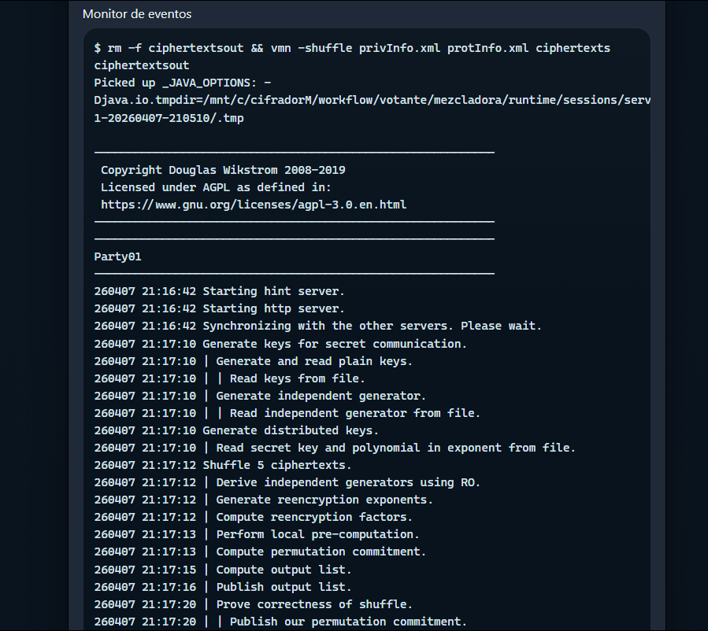

##### Fase 4 — Descifrado de votos (mezcladora)

En cada party, haga click en **Descifrar**:

1. **Party 1** → click en **Descifrar**
2. **Party 2** → click en **Descifrar**
3. **Party 3** → click en **Descifrar**

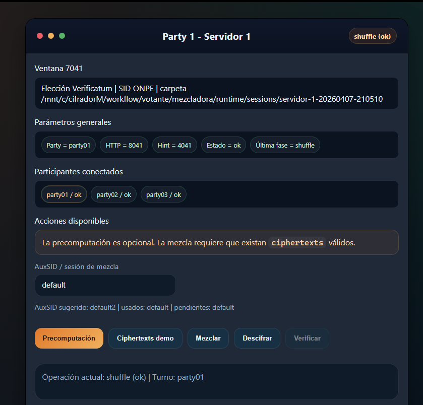

Espere a que termine el descifrado. El estado cambia a `Ultima fase = decrypt`
y aparece el boton **Descargar votos descifrados**.

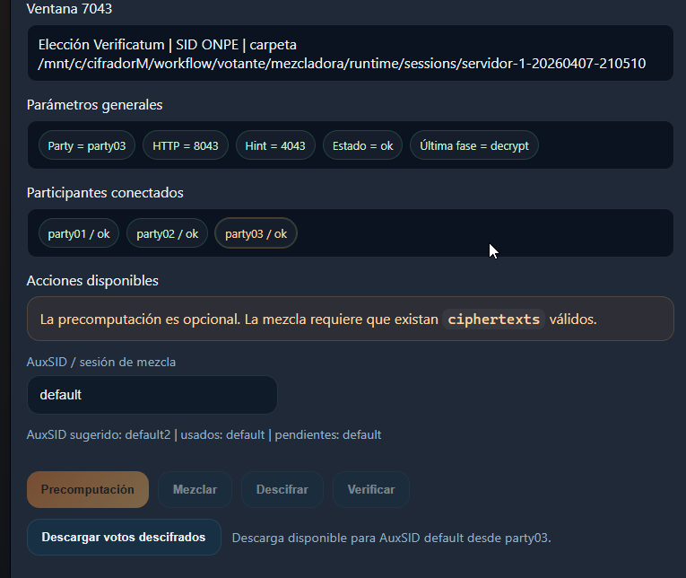

##### Fase 5 — Descarga y validacion

Desde cualquier party, haga click en **Descargar votos descifrados**. El archivo
contiene los votos en texto plano. Estos permiten validar que el cifrador cifro
correctamente desde el inicio y que la mezcladora lo demostro mediante la prueba
criptografica de mezcla.


### Anexo Windows

#### Integracion externa

Una aplicacion externa en Windows debe consumir:

- `ElGamalCipher-1.1.0.jar`
- `vecj-2.2.0.dll`
- `vmgj-1.3.0.dll`

Ejemplo por CLI:

```powershell
$PROJECT_ROOT = 'C:\cifradorM'
$APP_JAR = 'C:\cifradorM\mi-app.jar'

java `
  "-Djava.library.path=$PROJECT_ROOT\prebuilt\windows-x64" `
  -cp "$PROJECT_ROOT\prebuilt\java\ElGamalCipher-1.1.0.jar;$APP_JAR" `
  com.ejemplo.Main
```

Ejemplo por API Java embebida:

```java
import java.nio.file.Path;
import java.util.logging.Level;
import java.util.logging.Logger;
import pe.gob.onpe.votodigital.elgamalcipher.CifradorRequest;
import pe.gob.onpe.votodigital.elgamalcipher.CifradorRngMode;
import pe.gob.onpe.votodigital.elgamalcipher.ElGamalCipherService;
import pe.gob.onpe.votodigital.elgamalcipher.LogConfig;

public final class DemoCifrado {
    public static void main(String[] args) {
        Logger logger = LogConfig.getLogger(
            "./logs/demo-cifrador.log",
            Level.INFO, true, true, true, true, true
        );

        CifradorRequest request = new CifradorRequest(
            Path.of("recursos/publicKey"),
            Path.of("recursos/shuffled_votes.txt"),
            Path.of("salida/ciphertexts_ext"),
            CifradorRngMode.SOFTWARE,
            false
        );

        boolean ok = new ElGamalCipherService(logger).encrypt(request);
        if (!ok) {
            throw new IllegalStateException("El cifrado no produjo salida.");
        }
    }
}
```

Clases principales de la API:

- `pe.gob.onpe.votodigital.elgamalcipher.ElGamalCipherService`
- `pe.gob.onpe.votodigital.elgamalcipher.CifradorRequest`
- `pe.gob.onpe.votodigital.elgamalcipher.CifradorRngMode`
- `pe.gob.onpe.votodigital.elgamalcipher.LogConfig`

Importante:

- el artefacto canonico Windows es libreria, no `.exe`
- no copies solo el `jar`; copia tambien las DLL JNI

#### Layout nativo y carga de JNI

La aplicacion busca bibliotecas nativas en este orden:

1. `prebuilt/<os-arch>` (ej. `prebuilt/windows-x64/vecj-2.2.0.dll`)
2. `prebuilt`
3. `libs/<os-arch>`
4. `libs`

Si el `jar` se ejecuta sin `java.library.path` y encuentra un layout local valido,
puede relanzarse con la ruta correcta.

#### RNG y soporte de hardware

- `-sw` usa `SecureRandom`
- `-hw` usa TrueRNG por:
  - autodeteccion `VID:PID 04D8:F5FE`
  - propiedad JVM `-Delgamal.rng.device=COMx`
  - variable `ELGAMAL_RNG_DEVICE=COMx`

#### Empaquetado del cifrador como libreria

Build del bundle de libreria:

```powershell
cd C:\cifradorM
powershell -ExecutionPolicy Bypass -File .\scripts\windows\empaquetado\build-cifrador-portable.ps1
```

Salida:

- `dist/windows/library/Cifrador/app/ElGamalCipher-1.1.0.jar`
- `dist/windows/library/Cifrador/libs/windows-x64/vecj-2.2.0.dll`
- `dist/windows/library/Cifrador/libs/windows-x64/vmgj-1.3.0.dll`

ZIP del bundle:

```powershell
cd C:\cifradorM
powershell -ExecutionPolicy Bypass -File .\scripts\windows\empaquetado\package-cifrador-portable.ps1
```

Salida:

- `dist/windows/Cifrador-1.1.0-windows-x64-library.zip`

#### Bootstrap de Verificatum

El bootstrap solo es necesario si se quiere recompilar los JARs de Verificatum desde codigo
fuente (por ejemplo, para aplicar parches o actualizar versiones). En uso normal,
los JARs de `native/verificatum-jars/` son suficientes.

##### Ruta usada para bootstrap en Windows

Para la ruta minima documentada en este README, use una sola raiz:

- `C:\cifradorM`

Si alguna vez necesita recompilar Verificatum desde fuentes en Windows, el bootstrap debe
resolver los paquetes dentro del propio repo:

```
C:\cifradorM\native\verificatum-src\verificatum-vcr-3.1.0
C:\cifradorM\native\verificatum-src\verificatum-vecj-2.2.0
C:\cifradorM\native\verificatum-jars\com\verificatum\verificatum-vmgj\1.3.0\verificatum-vmgj-1.3.0.jar
```

Si el error dice `No se pudo ubicar verificatum-vcr-3.1.0. Rutas probadas: ...` significa
que los fuentes no estan en ninguna de esas ubicaciones. Con la version actual del proyecto,
los fuentes ya estan incluidos en `native\verificatum-src\` y los JARs precompilados en
`native\verificatum-jars\`, por lo que este error no deberia ocurrir despues de un `git pull`
si el repo esta en `C:\cifradorM`.

##### Dependencias esperadas para Windows

Para que `scripts/windows/compilacion/bootstrap-verificatum.ps1` funcione dentro de la ruta
minima de Windows, basta con que existan estas rutas dentro del repo:

- `C:\cifradorM\native\verificatum-src\verificatum-vcr-3.1.0`
- `C:\cifradorM\native\verificatum-src\verificatum-vecj-2.2.0`
- `C:\cifradorM\native\verificatum-jars\com\verificatum\verificatum-vmgj\1.3.0\verificatum-vmgj-1.3.0.jar`

Importante:

- para la ruta minima de prueba en Windows, use una sola raiz: `C:\cifradorM`
- el bootstrap es opcional; no hace falta para compilar ni para probar el cifrador normal
- solo considere `MIXNET_ROOT` o rutas externas si esta saliendo del flujo minimo de este README

```powershell
cd C:\cifradorM
powershell -ExecutionPolicy Bypass -File .\scripts\windows\compilacion\bootstrap-verificatum.ps1
```

## Ubuntu

### Guia Rapida Para Compilacion Del Cifrador En Ubuntu

Ruta unica recomendada para instalar, probar y desplegar en `Ubuntu 22.04+`:

- use `Bash`
- mantenga acceso a Internet para instalar dependencias

Instalacion minima de dependencias y descarga del repo:

```bash
sudo apt update
sudo apt install -y git openjdk-21-jdk build-essential autoconf automake libtool libgmp-dev
```

Descarga del repositorio:

```bash
git clone -b cifradorM https://github.com/rmartinezch/ElGamalClient.git ~/cifradorM
cd ~/cifradorM
```

Comprobaciones minimas del entorno instalado:

```bash
git --version
javac -version
java -version
test -d ~/cifradorM && echo "OK"
```

Resultado esperado:

- `git --version` responde sin error
- `javac -version` y `java -version` muestran `21`
- el directorio `~/cifradorM` existe

Comprobaciones minimas del repo clonado:

```bash
cd ~/cifradorM
git branch --show-current
git remote get-url origin
test -d native/verificatum-src/verificatum-vcr-3.1.0 && echo "OK"
test -d native/verificatum-src/verificatum-vecj-2.2.0 && echo "OK"
test -f native/verificatum-jars/com/verificatum/verificatum-vmgj/1.3.0/verificatum-vmgj-1.3.0.jar && echo "OK"
```

Resultado esperado:

- `git branch --show-current` devuelve `cifradorM`
- `git remote get-url origin` devuelve `https://github.com/rmartinezch/ElGamalClient.git`
- los tres `test` devuelven `OK`

Recompilacion minima de todos los artefactos Ubuntu (`jar + .so JNI`):

```bash
cd ~/cifradorM
./scripts/ubuntu/compilacion/build-cifrador.sh
```

Comprobaciones minimas del build:

```bash
test -f prebuilt/java/ElGamalCipher-1.1.0.jar && echo "OK"
ls -la prebuilt/java/ElGamalCipher-1.1.0.jar
ls -la prebuilt/linux-x64/
```

Resultado esperado:

- el JAR existe en `prebuilt/java/`
- las librerias nativas `.so` existen en `prebuilt/linux-x64/`

Este flujo:

- recompila el JAR principal del cifrador
- compila `libvecj.so` y `libvmgj.so`
- ejecuta `bootstrap-verificatum.sh` automaticamente si faltan artefactos de Verificatum

Artefactos recompilados para despliegue:

- `~/cifradorM/prebuilt/java/ElGamalCipher-1.1.0.jar`
- `~/cifradorM/prebuilt/linux-x64/libvecj.so`
- `~/cifradorM/prebuilt/linux-x64/libvmgj.so`

Prueba minima por CLI:

```bash
java -jar ~/cifradorM/prebuilt/java/ElGamalCipher-1.1.0.jar \
  ~/cifradorM/recursos/publicKey \
  ~/cifradorM/recursos/shuffled_votes.txt \
  ~/cifradorM/recursos/ciphertexts_ext \
  -sw \
  -p
```

Si el uso final es desde otra aplicacion Java en Ubuntu, despliegue siempre el `jar`
junto con ambas `.so` del directorio `prebuilt/linux-x64`.

### Guia Rapida: Mezcla Y Verificacion Del Cifrador Por CLI

Esta es la ruta minima para verificar que el cifrador cifra correctamente usando
directamente los comandos de Verificatum VMN por terminal, sin necesidad de la
GUI de la mezcladora ni de la estacion de votacion.

El flujo completo es:

1. instalar Verificatum VMN en Ubuntu nativo
2. crear sesion de 3 parties con `vmni` y generar llave con `vmn -keygen`
3. cifrar votos con el JAR del cifrador
4. convertir ciphertexts con `vmnc` y mezclar con `vmn -shuffle`
5. descifrar con `vmn -decrypt`
6. comparar votos descifrados con los originales

#### 1. Instalar Verificatum VMN

```bash
sudo apt-get update
sudo apt-get install -y m4 cpp gcc make libtool automake autoconf libgmp-dev openjdk-21-jdk wget
cd ~
wget https://github.com/rmartinezch/mixnet/raw/main/installer/verificatum-vmn-3.1.0-full.tar.gz
mkdir -p verificatum-vmn-3.1.0-full
tar xvfz verificatum-vmn-3.1.0-full.tar.gz -C verificatum-vmn-3.1.0-full
cd verificatum-vmn-3.1.0-full
sudo make install
```

Comprobacion minima:

```bash
vmn -version
command -v vmn vmni vmnc vmnd vog vmnv
vog -rndinit RandomDevice /dev/urandom
```

Resultado esperado:

- `vmn -version` responde sin error
- `command -v` devuelve rutas validas para los seis comandos
- `vog -rndinit` responde sin error

#### 2. Prueba automatizada (ruta rapida)

El repositorio incluye un script que ejecuta todo el flujo de forma automatica:

```bash
cd ~/cifradorM
./scripts/ubuntu/pruebas/test-cifrador-con-mezcladora.sh
```

El script:

- compila el cifrador si no esta compilado
- crea una sesion Verificatum de 3 parties con threshold 2
- ejecuta keygen distribuido (`vmn -keygen`)
- cifra los votos de `recursos/shuffled_votes.txt` con el JAR
- convierte ciphertexts a formato Verificatum (`vmnc -ciphs`)
- mezcla los votos (`vmn -shuffle`)
- descifra los votos (`vmn -decrypt`)
- convierte plaintexts a formato nativo (`vmnc -plain`)
- compara los votos descifrados con los originales

Resultado esperado:

```
  ✔ PRUEBA EXITOSA

  Los votos descifrados coinciden con los originales.
```

#### 3. Prueba paso a paso (ruta manual)

Si quiere ejecutar cada paso individualmente para entender el proceso:

##### 3a. Crear sesion Verificatum

```bash
cd ~/cifradorM
SESSION_DIR=target/test-mezcladora-manual
mkdir -p $SESSION_DIR

# Generar grupo eliptico P-256
PGROUP=$(cd $SESSION_DIR && vog -gen ECqPGroup -name 'P-256')

# Crear protocolo y parties
for i in 1 2 3; do
  P=party$(printf '%02d' $i)
  mkdir -p $SESSION_DIR/$P
  cd $SESSION_DIR/$P

  vmni -prot -sid ONPE -name EleccionDemo -nopart 3 -thres 2 -pgroup "$PGROUP"

  vog -rndinit RandomDevice /dev/urandom >/dev/null 2>&1 || true
  RAND=$(vog -gen RandomDevice /dev/urandom)

  vmni -party -e \
    -name "$P" \
    -hint "127.0.0.1:$((4040 + i))" \
    -http "http://127.0.0.1:$((8040 + i))" \
    -rand "$RAND"

  cp localProtInfo.xml protInfo$(printf '%02d' $i).xml
  cd ~/cifradorM
done

# Compartir protInfo entre parties
for i in 1 2 3; do
  for j in 1 2 3; do
    [ $i -eq $j ] && continue
    cp $SESSION_DIR/party$(printf '%02d' $i)/protInfo$(printf '%02d' $i).xml \
       $SESSION_DIR/party$(printf '%02d' $j)/
  done
done

# Fusionar protocolo global
for i in 1 2 3; do
  cd $SESSION_DIR/party$(printf '%02d' $i)
  vmni -merge protInfo01.xml protInfo02.xml protInfo03.xml protInfo.xml
  cd ~/cifradorM
done
```

##### 3b. Keygen distribuido

Las 3 parties ejecutan `vmn -keygen` simultaneamente (se comunican por red local):

```bash
cd ~/cifradorM
for i in 1 2 3; do
  (cd $SESSION_DIR/party$(printf '%02d' $i) && \
   vmn -keygen -e publicKey && \
   vmnc -pkey -outi native protInfo.xml publicKey publicKey_ext) &
  sleep 1
done
wait
```

Comprobacion:

```bash
test -f $SESSION_DIR/party01/publicKey && echo "OK: llave publica generada"
```

##### 3c. Cifrar votos

```bash
cd ~/cifradorM
java -jar prebuilt/java/ElGamalCipher-1.1.0.jar \
  $SESSION_DIR/party01/publicKey \
  recursos/shuffled_votes.txt \
  $SESSION_DIR/ciphertexts_ext \
  -sw \
  -p
```

##### 3d. Convertir y distribuir ciphertexts

```bash
cd ~/cifradorM

# Copiar a party01 y convertir de formato nativo a Verificatum
cp $SESSION_DIR/ciphertexts_ext $SESSION_DIR/party01/
cd $SESSION_DIR/party01
vmnc -ciphs -sloppy -ini native -width 1 protInfo.xml ciphertexts_ext ciphertexts

# Distribuir a todas las parties
for i in 2 3; do
  cp ciphertexts ciphertexts_ext ../party$(printf '%02d' $i)/
done
cd ~/cifradorM
```

##### 3e. Mezclar (shuffle distribuido)

Las 3 parties ejecutan `vmn -shuffle` simultaneamente:

```bash
cd ~/cifradorM
for i in 1 2 3; do
  (cd $SESSION_DIR/party$(printf '%02d' $i) && \
   vmn -shuffle privInfo.xml protInfo.xml ciphertexts ciphertextsout) &
  sleep 1
done
wait
```

##### 3f. Descifrar (decrypt distribuido)

Las 3 parties ejecutan `vmn -decrypt` simultaneamente:

```bash
cd ~/cifradorM
for i in 1 2 3; do
  (cd $SESSION_DIR/party$(printf '%02d' $i) && \
   vmn -decrypt privInfo.xml protInfo.xml ciphertextsout plaintexts_orig && \
   vmnc -plain -outi native protInfo.xml plaintexts_orig plaintexts) &
  sleep 1
done
wait
```

##### 3g. Validar resultado

```bash
ORIG=$(sort recursos/shuffled_votes.txt)
DESCIFRADO=$(sort $SESSION_DIR/party01/plaintexts)

if [ "$ORIG" = "$DESCIFRADO" ]; then
  echo "PRUEBA EXITOSA: los votos descifrados coinciden con los originales"
else
  echo "PRUEBA FALLIDA: los votos no coinciden"
fi
```

Esto valida que:

- el cifrador cifro correctamente usando la llave generada por Verificatum
- la mezcla (`vmn -shuffle`) preservo el contenido de los ciphertexts
- el descifrado distribuido (`vmn -decrypt`) entre las 3 parties recupero los votos originales en texto plano

#### Flujo Completo De Operacion (Ubuntu)

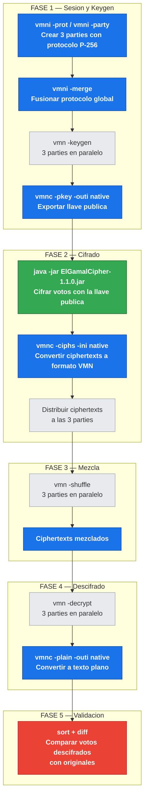

### Anexo Ubuntu

#### Integracion externa

Una aplicacion externa en Ubuntu debe enlazar el `jar` y exponer `libvecj` y `libvmgj`.

Ejemplo por CLI:

```bash
java \
  -Djava.library.path=/ruta/al/proyecto/prebuilt/linux-x64 \
  -cp /ruta/al/proyecto/prebuilt/java/ElGamalCipher-1.1.0.jar:mi-app.jar \
  com.ejemplo.Main
```

La API Java embebida es la misma que en Windows (`ElGamalCipherService`,
`CifradorRequest`, `CifradorRngMode`, `LogConfig`). Vea el ejemplo de codigo
en el [Anexo Windows](#anexo-windows).

#### Layout nativo y carga de JNI

La aplicacion busca bibliotecas nativas en este orden:

1. `prebuilt/<os-arch>` (ej. `prebuilt/linux-x64/libvecj-2.2.0.so`)
2. `prebuilt`
3. `libs/<os-arch>`
4. `libs`

Si el `jar` se ejecuta sin `java.library.path` y encuentra un layout local valido,
puede relanzarse con la ruta correcta.

#### RNG y soporte de hardware

- `-sw` usa `RandomDevice()` con `/dev/urandom`
- `-hw` usa TrueRNG por:
  - propiedad JVM `-Delgamal.rng.device=<ruta>`
  - variable `ELGAMAL_RNG_DEVICE`
  - valor por defecto `/dev/TrueRNG0`

#### Empaquetado del cifrador como libreria

Imagen portable:

```bash
./scripts/ubuntu/empaquetado/build-cifrador-portable.sh
```

Salida:

- `dist/linux/image/Cifrador/Cifrador`
- `dist/linux/image/Cifrador/runtime`
- `dist/linux/image/Cifrador/app`
- `dist/linux/image/Cifrador/libs/linux-x64`

Paquete comprimido:

```bash
./scripts/ubuntu/empaquetado/package-cifrador-portable.sh
```

Salida:

- `dist/linux/Cifrador-1.1.0-linux-x64-portable.tar.gz`

#### Bootstrap de Verificatum

El bootstrap solo es necesario si se quiere recompilar los JARs de Verificatum desde codigo
fuente (por ejemplo, para aplicar parches o actualizar versiones). En uso normal,
los JARs de `native/verificatum-jars/` son suficientes.

```bash
./scripts/ubuntu/entorno/bootstrap-verificatum.sh
```

## Android

### Guia Rapida Para Compilacion Del Cifrador En Android

Ruta unica recomendada para compilar y probar en `Android`:

- se ejecuta desde una maquina host `Ubuntu` o `Windows con WSL`
- requiere Android SDK y NDK instalados

Instalacion minima de dependencias en el host:

```bash
sudo apt update
sudo apt install -y git openjdk-21-jdk build-essential autoconf automake libtool libgmp-dev
```

Si aun no tiene Android SDK, instale Android Studio o el SDK command-line tools
y configure las variables de entorno:

```bash
export ANDROID_SDK_ROOT="$HOME/Android/Sdk"
export PATH="$ANDROID_SDK_ROOT/platform-tools:$ANDROID_SDK_ROOT/cmdline-tools/latest/bin:$PATH"
```

Descarga del repositorio (si aun no lo tiene):

```bash
git clone -b cifradorM https://github.com/rmartinezch/ElGamalClient.git ~/cifradorM
cd ~/cifradorM
```

Comprobaciones minimas del entorno instalado:

```bash
git --version
javac -version
java -version
test -d "$ANDROID_SDK_ROOT" && echo "SDK OK"
test -d ~/cifradorM && echo "Repo OK"
```

Resultado esperado:

- `git --version` responde sin error
- `javac -version` y `java -version` muestran `21`
- el SDK de Android existe
- el directorio `~/cifradorM` existe

Compilacion minima de todos los artefactos Android (`AAR + JNI`):

```bash
cd ~/cifradorM
./scripts/android/compilacion/build-cifrador.sh
```

Comprobaciones minimas del build:

```bash
test -f prebuilt/android/aar/ElGamalCipher-android-debug.aar && echo "OK"
ls -la prebuilt/android/jniLibs/arm64-v8a/
ls -la prebuilt/android/jniLibs/x86_64/
```

Resultado esperado:

- el AAR existe en `prebuilt/android/aar/`
- las librerias JNI existen para `arm64-v8a` y `x86_64`

Este flujo:

- compila las librerias JNI nativas para Android (`arm64-v8a`, `x86_64`)
- genera el AAR del cifrador Android

Artefactos compilados para despliegue:

- `~/cifradorM/prebuilt/android/aar/ElGamalCipher-android-debug.aar`
- `~/cifradorM/prebuilt/android/jniLibs/arm64-v8a/`
- `~/cifradorM/prebuilt/android/jniLibs/x86_64/`

Para consumir el AAR desde una app Android externa, agregue el `.aar` como dependencia
en el `build.gradle` de su proyecto. No necesita las `.so` sueltas; ya estan dentro del AAR.

### Guia Rapida: Levantar Estacion Android Y Mezcladora

Esta es la ruta minima para:

1. preparar una VM mezcladora con Verificatum y la GUI
2. compilar e instalar la estacion votante en un telefono Android por ADB
3. ejecutar una prueba operativa completa (crear sesion, votar, mezclar, descifrar)

Supuestos de esta ruta:

- el repo ya existe en `~/cifradorM` en la maquina host Ubuntu
- el host tiene Android SDK y NDK instalados
- hay un telefono Android conectado por USB con depuracion USB habilitada
- se tiene `multipass` instalado en el host

```mermaid
flowchart TD
    classDef mezcladora fill:#1a73e8,stroke:#0d47a1,color:#fff,font-weight:bold
    classDef estacion fill:#34a853,stroke:#1b5e20,color:#fff,font-weight:bold
    classDef party fill:#f9ab00,stroke:#e65100,color:#000,font-weight:bold
    classDef espera fill:#e8eaed,stroke:#9aa0a6,color:#333
    classDef resultado fill:#ea4335,stroke:#b71c1c,color:#fff,font-weight:bold

    subgraph PREP["PREPARACION"]
        VM["Crear VM mezcladora<br/>multipass + Verificatum"]:::mezcladora
        BUILD["Compilar cifrador Android<br/>AAR + JNI"]:::estacion
        INSTALL["Instalar estacion votante<br/>en telefono via ADB"]:::estacion
        VM --> BUILD --> INSTALL
    end

    subgraph FASE1["FASE 1 — Sesion y Llave"]
        M1["Mezcladora GUI<br/>http://IP_VM:7040"]:::mezcladora
        M2["Click en Nueva Sesion"]:::mezcladora
        M3["Keygen distribuido<br/>(3 parties)"]:::espera
        M4["Llave creada<br/>Esperando votos"]:::mezcladora
        M1 --> M2 --> M3 --> M4
    end

    subgraph FASE2["FASE 2 — Emision de Voto"]
        E1["Estacion Android<br/>en telefono"]:::estacion
        E2["Handshake + descarga<br/>llave publica"]:::estacion
        E3["Emitir voto cifrado"]:::estacion
        E1 --> E2 --> E3
    end

    subgraph FASE3["FASE 3 — Mezcla"]
        P1M["Party 1 - Mezclar"]:::party
        P2M["Party 2 - Mezclar"]:::party
        P3M["Party 3 - Mezclar"]:::party
        MW["Mezclando votos..."]:::espera
        P1M --> P2M --> P3M --> MW
    end

    subgraph FASE4["FASE 4 — Descifrado"]
        P1D["Party 1 - Descifrar"]:::party
        P2D["Party 2 - Descifrar"]:::party
        P3D["Party 3 - Descifrar"]:::party
        DW["Descifrando votos..."]:::espera
        P1D --> P2D --> P3D --> DW
    end

    subgraph FASE5["FASE 5 — Validacion"]
        DL["Descargar votos descifrados"]:::party
        VL["Validar que el voto<br/>fue correctamente cifrado"]:::resultado
        DL --> VL
    end

    INSTALL --> M1
    M4 --> E1
    E3 --> P1M
    MW --> P1D
    DW --> DL
```

#### 1. Preparar la VM de la mezcladora

El script crea una VM multipass Ubuntu 24.04, instala Verificatum VMN 3.1.0,
Python 3 y monta el repositorio:

```bash
cd ~/cifradorM
./scripts/android/entorno/setup-mezcladora-vm.sh
```

El script:

- crea la VM `mezcladora` con 4 CPU, 4 GB RAM, 20 GB disco
- instala dependencias base (Python 3, GCC, GMP, Java 21)
- instala Verificatum VMN 3.1.0
- monta `~/cifradorM` del host en la VM

Comprobacion minima:

```bash
multipass exec mezcladora -- bash -lc "vmn -version && python3 --version"
```

Resultado esperado:

- `vmn -version` responde `3.1.0`
- `python3 --version` responde `3.x`

Obtener la IP de la VM (se usara en pasos posteriores):

```bash
VM_IP=$(multipass info mezcladora --format csv | tail -1 | cut -d, -f3)
echo "IP mezcladora: $VM_IP"
```

#### 2. Levantar la mezcladora en la VM

En una terminal dedicada (quedara bloqueada sirviendo):

```bash
multipass exec mezcladora -- bash -lc \
  "cd ~/cifradorM/workflow/votante/mezcladora && ./start_gui.sh"
```

Resultado esperado:

- la GUI queda publicada en `http://$VM_IP:7040`
- las parties usan puertos `7041` a `7049`

Comprobacion desde el host:

```bash
curl -s http://$VM_IP:7040/api/health
```

Resultado esperado:

- responde `{"ok": true}`

#### 3. Compilar el cifrador Android y la estacion votante

En otra terminal en el host:

```bash
cd ~/cifradorM
./scripts/android/compilacion/build-cifrador.sh
```

Comprobacion minima:

```bash
test -f prebuilt/android/aar/ElGamalCipher-android-debug.aar && echo "AAR OK"
ls prebuilt/android/jniLibs/arm64-v8a/
```

Resultado esperado:

- el AAR existe en `prebuilt/android/aar/`
- las librerias JNI existen para `arm64-v8a`

Compilar la estacion votante APK apuntando a la mezcladora:

```bash
cd ~/cifradorM
VOTANTE_ANDROID_SERVICE_BASE_URL="http://$VM_IP:7040" \
  ./workflow/votante/android/build-votante-portable-apk.sh
```

Comprobacion minima:

```bash
test -f dist/android/VotanteAndroid-portable.apk && echo "APK OK"
```

#### 4. Instalar la estacion en el telefono via ADB

Conecte el telefono por USB y verifique que ADB lo detecta:

```bash
adb devices
```

Resultado esperado:

- aparece un dispositivo con estado `device`

Si el telefono pide confirmacion de depuracion USB, acepte en la pantalla.

Instalar ambos APKs y lanzar las apps:

```bash
cd ~/cifradorM
LAUNCH_APPS=1 ./scripts/android/despliegue/build-and-install-phone.sh
```

Si los artefactos ya estan compilados del paso anterior, puede saltar la
recompilacion:

```bash
BUILD_CIFRADOR=0 BUILD_TOOL_ANDROID=0 BUILD_VOTER_ANDROID=0 LAUNCH_APPS=1 \
  ./scripts/android/despliegue/build-and-install-phone.sh
```

Resultado esperado:

- se instala `TrueRNG-Diagnostico.apk`
- se instala `VotanteAndroid-portable.apk`
- ambas apps se lanzan en el telefono

#### 5. Prueba operativa

##### 5a. Crear sesion y llave (mezcladora)

Abra `http://$VM_IP:7040` en un navegador y haga click en **Nueva sesion y ejecutar keygen**.

La mezcladora ejecuta el keygen distribuido entre las 3 parties. Cuando termine,
aparece la **Sesion activa** con el ID y las ventanas de parties con estado `ok`.

##### 5b. Emision de voto (telefono Android)

Abra la app **Votante Android** en el telefono. La estacion realiza el handshake
automatico con la mezcladora y descarga la llave publica. El panel de estado
muestra Mezcladora: `Activa`, Llave: `Disponible`.

En la **Cedula de votacion** seleccione las opciones para cada eleccion y
haga click en **Emitir voto cifrado**.

Resultado esperado:

- aparece la **Constancia de recepcion** con estado `Confirmada`
- el monitor de eventos muestra el cifrado y envio exitoso

##### 5c. Mezcla de votos (mezcladora)

En la GUI de la mezcladora (`http://$VM_IP:7040`), abra la ventana de cada
party (links **Abrir ventana 7041/7042/7043**) y en cada una haga click
en **Mezclar**:

1. **Party 1** → click en **Mezclar**
2. **Party 2** → click en **Mezclar**
3. **Party 3** → click en **Mezclar**

Espere a que todas las parties completen el shuffle.

##### 5d. Descifrado de votos (mezcladora)

En cada party, haga click en **Descifrar**:

1. **Party 1** → click en **Descifrar**
2. **Party 2** → click en **Descifrar**
3. **Party 3** → click en **Descifrar**

Espere a que termine el descifrado.

##### 5e. Descarga y validacion

Desde cualquier party, haga click en **Descargar votos descifrados**. El archivo
contiene los votos en texto plano. Estos permiten validar que el cifrador Android
cifro correctamente y que la mezcladora lo verifico mediante la prueba criptografica.

#### Resumen de puertos (Android + Mezcladora)

| Componente | Puerto | Host | Proposito |
| :--- | :---: | :--- | :--- |
| Mezcladora GUI | 7040 | IP de la VM | Panel de control web |
| Party 1 | 7041 | IP de la VM | Comunicacion party 1 |
| Party 2 | 7042 | IP de la VM | Comunicacion party 2 |
| Party 3 | 7043 | IP de la VM | Comunicacion party 3 |
| Estacion Android | app nativa | Telefono | Cabina de votacion |

### Anexo Android

#### Integracion externa

En `Android` no se usa el cifrador como proceso externo ni como CLI independiente.

La forma correcta de integracion es consumir el `AAR` compilado dentro de la app Android, es decir, usar la API publica del cifrador como libreria embebida:

```kotlin
dependencies {
    implementation(files("/ruta/al/proyecto/prebuilt/android/aar/ElGamalCipher-android-debug.aar"))
}
```

API Android principal:

- `pe.gob.onpe.votodigital.cifrador.android.AndroidCipherRunner`
- `pe.gob.onpe.votodigital.cifrador.android.AndroidCipherLibraryInfo`
- `pe.gob.onpe.votodigital.cifrador.android.AndroidTrueRngSupport`

El `AAR` ya empaqueta:

- bridge Android
- `jniLibs` para `arm64-v8a`
- `jniLibs` para `x86_64`
- soporte TrueRNG USB para Android

#### RNG y soporte de hardware

- `-sw` usa `SecureRandom`
- `-hw` usa TrueRNG USB cuando el dispositivo esta conectado por OTG, Android detecta un driver serial compatible y la app ya tiene permiso USB
- el `AAR` ya incluye `AndroidTrueRngSupport` y `AndroidUsbTrueRngRandomSource`; no hace falta que la app consumidora implemente por su cuenta la lectura del TrueRNG
- si no hay dispositivo, driver o permiso USB, la ejecucion en modo hardware falla de forma explicita; no se degrada silenciosamente a `SecureRandom`
- la app consumidora si debe manejar permisos USB, diagnostico del dispositivo y ciclo de vida Android alrededor del uso del TrueRNG

En otros sistemas no listados, `-sw` y `-hw` usan `SecureRandom`.

#### Empaquetado del cifrador como libreria

Imagen portable:

```bash
./scripts/android/empaquetado/build-cifrador-portable.sh
```

Salida:

- `dist/android/image/Cifrador/aar/Cifrador-android-debug.aar`
- `dist/android/image/Cifrador/jniLibs/arm64-v8a/`
- `dist/android/image/Cifrador/jniLibs/x86_64/`
- `dist/android/image/Cifrador/metadata/checksums.sha256`

Paquete comprimido:

```bash
./scripts/android/empaquetado/package-cifrador-portable.sh
```

Salida:

- `dist/android/Cifrador-1.1.0-android-portable.zip`

#### Bootstrap de Verificatum

- reutiliza el mismo repositorio `native/verificatum-jars/` del proyecto
- no requiere un bootstrap Verificatum separado para consumir el `AAR`
- la compilacion Android resuelve dependencias directamente de `native/verificatum-jars/`

Los tres artefactos Verificatum resueltos automaticamente son:

- `com.verificatum:verificatum-vmgj:1.3.0`
- `com.verificatum:verificatum-vecj:2.2.0`
- `com.verificatum:verificatum-vcr-vmgj-vecj:3.1.0`

## Resumen De Rendimiento

Prueba de referencia con `10,000` votos:

| Metrica | Version Original | Version Optimizada | Mejora |
| :--- | :---: | :---: | :---: |
| Tiempo de ejecucion | ~1m 22s | ~10s | ~8x |
| Uso de CPU | un nucleo | multi-nucleo | mejora sustancial |

Mejoras clave:

- paralelismo con streams
- `ThreadLocal<RandomSource>`
- barra de progreso opcional
- control de modo hardware para TrueRNG

## Historial Breve

### Version 1.1.0

- refactor para calidad de codigo
- uso de capacidades modernas de Java 21
- mejoras de logs, estructura y portabilidad

### Version 1.0.0

- optimizacion de rendimiento
- paralelismo y mejora del acceso al RNG

### Rama `cifradorM`

- soporte multiplataforma
- empaquetado nativo por plataforma
- consolidacion del cifrador como libreria reusable
- proyecto autocontenido: JARs Verificatum en `native/verificatum-jars/` (ya no requiere bootstrap)
- Maven Wrapper incluido (`mvnw` / `mvnw.cmd`)
- fuentes VCR 3.1.0 incluidos en `native/verificatum-src/`
- verificado en Ubuntu, Windows 11 y Android (emulador API 34)
